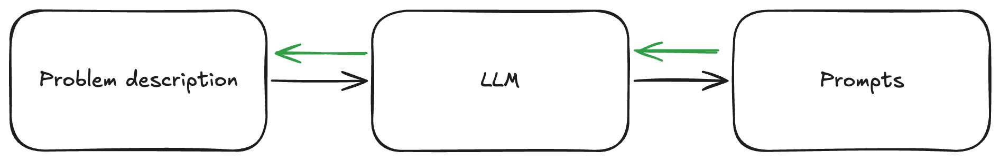

<!-- more -->

# Patterns for Effective Usage of LLMs

## Core Principles

**Start with Yourself, Not the Tool**

The quality of your output is directly related to the intentional effort you put into the task. AI doesn't reduce quality—it makes your effort more efficient during the time window you're working. Learning how to use AI effectively means leveraging its capabilities while mitigating its negative incentives.

**Have a Prediction**

Always form expectations about what the AI should produce. Without a mental model of the desired outcome, you'll either accept low-quality output or fall into infinite revision loops. Having clear predictions helps you evaluate and improve AI responses effectively.

**Match Tools to Cognitive Complexity**

Use "planners" (reasoning models) for thinking tasks and "workhorses" (fast models) for execution. The key is matching the right AI model to the cognitive complexity of your specific task.

## Code Generation

**Paste Code + Error for Debugging**

Copy paste from ChatGPT/Claude/Gemini/Llama3 and also paste in error + original code to get better answers. Include the full error message and relevant context.

**Automate Cleaning AI Output**

Setup a quick tool to clean up the Python code generated (use an alias like `clean-python` for rapid post-processing of AI-generated code).

**Use Standalone Scripts with AI + uv**

Generate Python standalone scripts by using Claude+Projects with custom descriptions and the uv package manager for rapid prototyping and deployment.

**Leverage Context Effectively**

For recent coding frameworks, use documentation as json/markdown files as context for Claude/ChatGPT projects. Show the LLM how to call an API in the prompt, then ask it to create something with that API. This pattern works especially well for:
- API integrations
- Framework-specific implementations
- Custom library usage

**Claude Projects for Code Organization**

Use Claude Projects for knowledge/context organization while Custom GPTs work better for automation and sharing. Projects excel at maintaining coding context across sessions.

## Learning and Research Workflows

**Research Tools Hierarchy**

1. **NotebookLM** - Excellent general tool for students, supports interactive mindmaps and multi-source analysis
2. **Elicit** - Specialized for academic research with evidence-based insights
3. **ChatGPT** - Feature-rich daily driver with search, canvas, and analysis capabilities
4. **Claude + Projects** - Superior for code prototyping and iterative development
5. **Perplexity/ChatGPT Search** - For real-time information and current events

**Knowledge Management Patterns**

When creating knowledge management prompts (like for Anki cards), structure them around these 5 key dimensions:
- Attributes & tendencies
- Similarities and differences  
- Parts & Wholes
- Causes & Effects
- Significance & Implications

This approach moves beyond simple memorization towards deeper knowledge encoding.

**Study and Exam Preparation**

- Use "Quiz Yourself from PDF" workflows with ChatGPT
- Create study guides by combining multiple sources in NotebookLM
- Generate practice questions using context documents
- Use text-to-speech for consuming research papers and documentation during commutes

**Research Workflow Patterns**

1. **Start Broad, Then Narrow**: Use web search for overview, then dive deep with specialized tools
2. **Source Verification**: Cross-reference findings across multiple AI research tools
3. **Citation Extraction**: Use tools like Google AI Studio to extract organized citation tables from papers
4. **Iterative Refinement**: Build research reports in stages, using different models for different phases

## General Usage Patterns

**Screen Sharing for Contextual Help**

Use tools like Gemini 2.0 with streaming in Google AI Studio so the AI can see your screen to help navigate new software and answer app-specific questions in context.

**AI Mistake Collection**

When AI makes mistakes in your field of expertise, save them for later as your personal benchmark. This helps you understand model limitations and improve your prompting.

**Micro-AI Data Transformation Pipelines**

Build applications with AI that take data with a certain structure and output desirable formats. Create prompt templates that transform data into formats acceptable by downstream applications.

**Background AI Assistance**

Run lighter models (Tier 3) in the background for gentle guidance without disrupting workflow:
- Watch note creation to suggest knowledge structuring patterns
- Use SuperWhisper to transform free-form thinking into structured content
- Convert audio brainstorming into written documentation

**Voice-to-Structure Workflow**

Use speech-to-text tools like SuperWhisper + reasoning LLMs to:
- Dictate rambling thoughts and have AI create structured summaries
- Transform voice notes into actionable content
- Create "AI control center" workflows for hands-free productivity

## Prompt Engineering Patterns

**Informed Transformation**

```
Given this {{ context }}. Do {{ action }} to this {{ content }}.
```

**The OUTPUT ONLY Pattern**

Prime model at the very end with:

```(...previous context...) OUTPUT ONLY {{ desired output }}```

**CRE Framework**

Structure prompts using:
- **Context**: Relevant background information
- **Request**: Specific action you want performed
- **Examples**: Sample inputs/outputs when helpful

**Meta Prompts for Complex Tasks**

Use prompts to generate prompts! Create a meta-prompt that uses a model to generate multiple prompts addressing all parts of your task.



For example:

```
I need to create a series of prompts to help me analyze customer feedback data. 
Please generate 3 prompts for an LLM model to help me:

1. Extract key themes and sentiment
2. Identify urgent issues needing attention
3. Generate actionable insights for product improvements

For each prompt you generate, explain its purpose and expected output format.

OUTPUT ONLY the prompts and their explanations, formatted as such:
PURPOSE: <purpose of prompt>
Instruction: <main instruction>
OUTPUT FORMAT: <desired output format>
```

**Pedagogical Prompting**

For educational content, be specific about:
- **The Learner**: age, motivation, prior knowledge, goals
- **Learning Objective**: what the content should achieve
- **Context**: where and how it will be used
- **Cognitive Load**: balance clarity with minimal viable content

**Workflow-as-a-Skill Development**

Develop systematic approaches to common tasks:
- Document your successful prompt patterns
- Create reusable templates for frequent workflows
- Build prompt libraries for domain-specific tasks

## Model Selection Strategy

### Model Tiers and Use Cases

#### Tier 1 (High Intelligence, Slow, Expensive)
- **Models**: DeepSeek R1, GPT-o1, Claude 3.5 Opus
- **Use for**: Complex reasoning, strategic planning, nuanced analysis
- **Learning applications**: Deep research synthesis, complex problem solving
- **Limit usage**: Reserve for tasks requiring maximum cognitive capability

#### Tier 2 (Balanced Performance)
- **Models**: GPT-4o, Claude 3.5 Sonnet, Gemini 1.5 Pro, Llama 3.3
- **Use for**: Daily driver tasks - code, emails, general queries, content creation
- **Learning applications**: Essay writing, concept explanation, moderate research
- **Sweet spot**: Best balance of capability and cost for most educational tasks

#### Tier 3 (Fast, Cheap, High Volume)
- **Models**: GPT-4o-mini, Gemini Flash, Llama 3.1/3.2
- **Use for**: Bulk processing, background tasks, initial drafts
- **Learning applications**: Quick summaries, basic Q&A, content formatting
- **Strategy**: Enable AI usage in "every nook and cranny" of your workflow

### Cognitive Complexity Matching

**Use Reasoning Models (Tier 1) for:**
- Vague or poorly-defined problems
- Multi-step logical reasoning
- Complex synthesis across sources
- Strategic decision-making
- Academic research requiring deep analysis

**Use Standard Models (Tier 2/3) for:**
- Well-defined tasks with clear parameters
- Content generation and editing
- Data processing and formatting
- Routine question answering
- Implementation of pre-planned solutions

### Multi-Model Workflow Example

1. **Initial Processing (Tier 3)**: Quickly process large documents, extract key information
2. **Structured Analysis (Tier 2)**: Refine outputs, apply structured reasoning, generate content
3. **Final Synthesis (Tier 1)**: Complex reasoning, strategic insights, critical evaluation

## Advanced Learning Applications

**NotebookLM Workflows**
- Upload multiple sources for comparative analysis
- Generate interactive mindmaps from research materials
- Create audio overviews of complex topics
- Use source checking/unchecking for different perspectives

**Image Generation for Learning**
- Generate UI mockups for design students
- Create visual aids for complex concepts
- Develop infographics from text content
- Use image generation for memorization techniques

**ChatGPT Advanced Features**
- **Canvas**: Collaborative editing and iteration
- **Projects**: Organized context management
- **Search**: Real-time information integration
- **Advanced Voice**: Natural conversation and clarification

**Custom GPT Development**
- Use O1 to create sophisticated customizations
- Build domain-specific assistants
- Create repeatable workflow automations
- Share specialized tools with teams

## Data Analysis and Research

**Step-by-Step Analysis Pattern**

Break complex analysis into steps that fit working memory/cognitive load:
1. Data overview and structure assessment
2. Initial cleaning and preparation
3. Exploratory analysis
4. Focused investigation
5. Synthesis and insights

**Cross-Platform Integration**
- Use Gemini + Google Colab for data analysis
- Integrate ChatGPT with Google Sheets for ongoing analysis
- Combine NotebookLM with external data sources
- Export results to various formats for further processing

**Citation and Source Management**
- Extract structured citation tables from papers
- Organize references across multiple sources
- Fact-check and verify AI-generated citations
- Maintain source credibility tracking

## Best Practices and Limitations

**Quality Control Strategies**
- Always verify claims in your area of expertise
- Cross-reference important facts across multiple sources
- Be aware of potential misinformation by omission
- Maintain healthy skepticism while leveraging AI capabilities

**Educational Integration Guidelines**
- Focus on AI as a thinking partner, not a replacement for learning
- Develop critical evaluation skills alongside AI usage
- Understand when to rely on AI vs. when to think independently
- Balance efficiency gains with skill development

**Cognitive Load Management**
- Break complex tasks into smaller, manageable chunks
- Use AI to handle routine tasks while focusing mental energy on high-value activities
- Maintain awareness of when cognitive delegation is appropriate
- Develop "cognitive endurance" through intentional practice

**Security and Privacy Considerations**
- Be mindful of data sharing with AI services
- Understand the privacy implications of different tools
- Consider local/self-hosted options for sensitive work
- Follow institutional guidelines for AI usage in academic/professional contexts

This comprehensive guide provides actionable patterns for maximizing the effectiveness of LLMs across learning, research, coding, and general productivity workflows. The key is matching the right tool and approach to your specific context and goals while maintaining quality and developing genuine expertise.