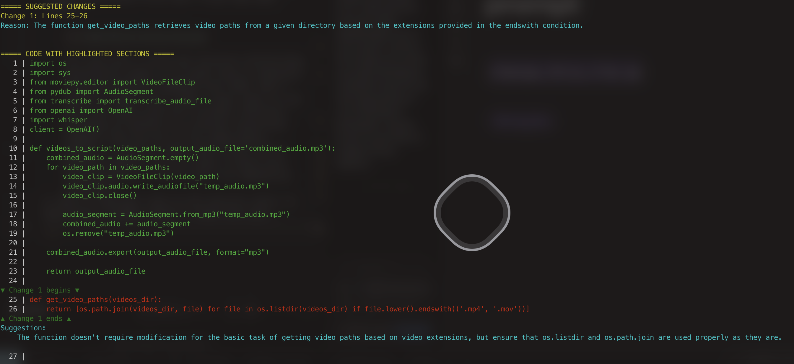

<!-- more -->

# AI Tools, Life, Travel & Thoughts

In this post I just want to talk a little bit about some of the stuff I've been doing, what I've been 'working on', some AI tools I've been playing around with and some other stuff.

## AI Tools - Cursor

This year I've been using [Cursor](www.cursor.com) more and more, I've been following in love with the process of finding new avenus of leveraging LLMs in new and exciting ways. On the one hand I carry a bit of that fear of never being able to code again without some AI hanging over me, on the other, building things through conversation can be quite exciting. 

Even as I write this post I'm thinking! "Hey, I don't have a simple automation to create a references section for my article!". Then, immediately I already think: "Ah, never mind, I can just ask Cursor to generate that when I'm done writing.

Cursor is cool, and these are some of the things I've been getting more interested lately and intend to explore:

## 1. [Cursor rules files](https://docs.cursor.com/context/rules-for-ai)

These are like files you can easily create `.cursorrules` and then inside you describe how Cursor should behave within the scope of a project.

The cool thing is that you can make it even better by creating a folder on your root like: `.cursor/rules`, and then inside you can write spefications per programming language or file type, its bananas.

## 2. [Cursor Agentic Mode](https://docs.cursor.com/chat/agent)

It's been fun to watch Cursor building whatever I want by just asking, then see the whole process unwind in front of me as if I'm some sort of low budget god of silly little apps.

## 3. [MCP + Cursor](https://docs.cursor.com/context/model-context-protocol)
I'll be honest, this is one of those that I haven't fully explored yet, essentially [MCP came out](https://www.youtube.com/watch?v=kQmXtrmQ5Zg&t=29s) and took the AI engineering world by storm.
I haven't studied it in full yet, but essentialy its a standardization of what previously was simply LLM + tool calling in the wild. Now we have something more like a standard to follow to connect LLMs to tools, resources and prompts, and the promise seems to be quite exciting.

## AI Tools - Aider, Claude-code, Building Rust apps
Another fun things I've been doing lately is attempting to replace doom scrolling with what I think I'll start calling 'doom app creating' which essentially means talking to [aider](https://aider.chat/) via its really neat `/voice` mode and essentially just ask it to build whatever is in my mind.

What fascinates me more about this approach is how "un-creative" I can be, which I know, sounds kind of self-deprecating, but it does piss me off, like I am living in the most creative-friendly era in history and all I can come up with is like 'a todo-list with some fun interactive animations'? God damn...Davinci would have been very disappointed. { width="50%" }


Nevertheless, some times I have my moments and I think I come up with ideas that could at least have some potential, if it wasn't for me abandoning them immediately after I build a first 'barely functional' version of it. Some of the highlights for this week built with either Cursor or aider were:

1. __Silly todo-list with rust (yes I built a todo list leave me alone)__

    {width="50%"}

2. __A 'barely working' clipboard manager__

    {width="50%"}

3. __A completely useless markdown note taking app (again why? It is beyond me at this point)__

    {width="50%"}

4. __The worst 'Focus App' ever (essentially a timer with a dot in the middle for you to 'focus')__
    {width="50%"}

5. __A template generator app to leverage llms to iterate on templates for very precise/structured command generation (this one I think had some future!)__

    

    The idea here I think was actually interesting, essentially today it is super easy to generate like big terminal commands with LLMs, and I wanted to have like a super sleak, easy to use tool that would give me a minimal interface allowing to iterate on a certain structured command like the one in the image above.
    However, I tend to leave these silly little projects behind...but at least I wrote this little piece on it so it won't be completely forgotten.

6. __App to highlight code on the specific parts to edit given a prompt (again I liked this one!).__
   
   Again with this one, even though obviously you get this type of functionality in any IDE these days, I wanted something easy that works well in the terminal and again, it was just a minute with Cursor to have a perfectly functional version! Also, I am really interested in like ways to leverage AI to visualize stuff better so this was actually the first app I made with that concept in mind. 

7. __App that allows you to navigate highlighted portions of a text__
   
   The idea here was that, since now it's so easy and fast to use embeddings ([even in the terminal!](https://arc.net/l/quote/mblwuutr)) to select parts of a large text given some input (like a question, or a semantic request like 'the tools used in this paper'), I wanted to have a simple and easy to use interface to navigate those portions of the text once the relevant sections were extracted. Still have some faith for this project....

There are so many more but I think those are enough to pain the picture of the mess that is my 'random-apps' folder. Some of them were built with `aider` some with the new [`claude-code`](https://github.com/anthropics/claude-code), all of them were built kind of without strong intentions, just as a exercise on chaotic experimentation.

Now, one last note I'll say on this topic is the revolutionary change on my workflow and day-to-day by integrating llms in the terminal using SImon Willison's [LLM-CLI](https://github.com/simonw/llm). I can now write commands like:

```
`for f in *.txt; do echo ${f%.txt}.pdf >> file_classification.txt; cat $f | llm 'Give this file a one sentence description' >> file_classification.txt
```
Which for me, has been the most fun I've had with AI besides what I'm about to tell you in the end of this article ;) .

---

## AI Tools - LLM + HTML/JS Apps = ❤️

One combination I've found to work really well for a lot of stuff is to combine a powerful code model like [Claude-3.7-sonnet](https://www.anthropic.com/news/claude-3-7-sonnet), and then ask it to generate an app in pure html/js combined with this idea of splitting the logic of the code itself from the logic of the data (something that a lot of developers would be like 'seriously? Now you see the value of that? Oh wow!' but hey! I'm new-ish at this ok?). 

What you get is the ability to make apps that have 0 dependencies, can run directly on your browser and just works, so its like...whatever app you use that is simple enough can probably be replaced by a prompt,, 15 minutes and a cup of coffee ;).

My biggest sucess with this combination was to write this quiz app in a single `.html` file that I use to test myself on different subjects. 

To say it has a 'simple interface' it would be an understatement, its as plain as it gets: 


I load the questions in the right format (almost always generated by AI ;)) and then I quiz myself on whatever. The biggest use I had was to prepare for a 'The Office' themes quiz night at a bar here in Lisbon (hey we got 2nd place ok! B) ).

{width="80%"}

{width="80%"}

{width="80%"}

I've made some upgrades to this app but I haven't pulled the trigger yet because I love the simplicity of this current version.

What I love the most about this is to be able to think of something that could be small and simple, yet powerfullly useful and effective for my current needs and workflows, and then just make it, and then use it! How cool is that?

I even made a course that I teach live at the [O'Reilly platform](https://www.oreilly.com/) where I talk about this subject and I generally use this quiz app example as one of the study cases. Here is the course if you're interested:

- [Building Simple Web Apps with AI Tools](https://www.oreilly.com/live-events/building-simple-web-apps-with-ai-tools/0642572013427/)

There is a lot to develop for this course still but I am excited for the next iteration of it coming up this year.

## Some Personal Stuff

Ok, to be quick, let's list a few things that I think were good this year:

1. [LangChain Retweeted my article about building LLM agents in 3 levels of complexity (it got over 30.3k views!)](https://x.com/LangChainAI/status/1740409019901386911)
2. I hosted my very first in-person [AI Tools Workshop](https://www.meetup.com/ai-tools-for-day-to-day/events/304671968/?eventOrigin=group_past_events)! This first iteration was about tools for filmmaking. I could have done a better job with the structure, but overall people really liked it and I think it was packed with actionable tips and practically insightful ideas. 
3. I've been working on my new workshop that I intend to publicize soon about AI tools for studying, learning and research with a focus on actually helping students and researchers to get the most out of AI without having to necessarily off load all the cognitive load and the effort of something to the AI.
4. I also had my first 2 potential AI clients this year which is super exciting, both were related to building agents so that's something I'll probably be focusing this year.
5. I had even more courses approved at OReilly where I currently teach a variety of online courses about LLMs, Agents and so on. The list is below if you want to check them out:
      1. [Using AI Tools and Python to Automate Tasks](https://www.oreilly.com/live-events/using-ai-tools-and-python-to-automate-tasks/0642572011642/)
      2. [Building AI Apps with Gemini 2.0](https://www.oreilly.com/live-events/building-ai-apps-with-gemini-20/0642572015029/)
      3. [Working with o1, DeepSeek, and Gemini 2.0 Reasoning Capabilities](https://www.oreilly.com/live-events/working-with-o1-deepseek-and-gemini-20-reasoning-capabilities/0642572015593/)
   
I also have 2 other courses right now in the works that I hope will be live in the second half of this year.

6. Working remote has its perks, one of which is travelling whenever I want! This year I've been to a few places already:
      1. Netherlands
      2. London
      3. Ireland
      4. Italy (Venice, Verona, Milan)
      5. Switzerland (spent a day in Zurich! :))
    
    {width=50%}{width=50%}
    {width=50%}{width=50%}
    {width=50%}{width=50%}


## Final Thoughts on Working in AI

It has been a bit surreal, over these past 2 years, how my life changed completely because of AI. Like if only I knew how right my decision was to leave Brazil and come to Europe to pursue it. 

I remember it like it was yesterday, my excitement when I first started working at the Champalimaud Foundation, considered to be a [world class lab for contributions to artificial intelligence](https://www.portugalglobal.pt/media/tqzeuasw/aicep0122.pdf) I felt like that experience was going to shape my upcoming years, like my life was about to radically change, and indeed it happened! Even tough I didn't pursue a PhD in the lab, having finished my masters there and then having worked there as a hired research assistant (working on an application of generative adversarial networks to neuroscience settings) really helped me understand the inner workings of AI, how to use it, and how to get the most out of it.

Now, working as an AI engineer, freelancer, AI instructor, everything seems quite magical, like sometimes I have to pinch myself because it feels unreal that I get paid to do the kind of stuff I get paid to do.

From now on I'll be focusing more on producing higher technical quality content on Youtube, pursue more clients as a freelancing AI engineer, and continue to produce courses with OReilly as well as on my own, I can't wait for what's next :).

