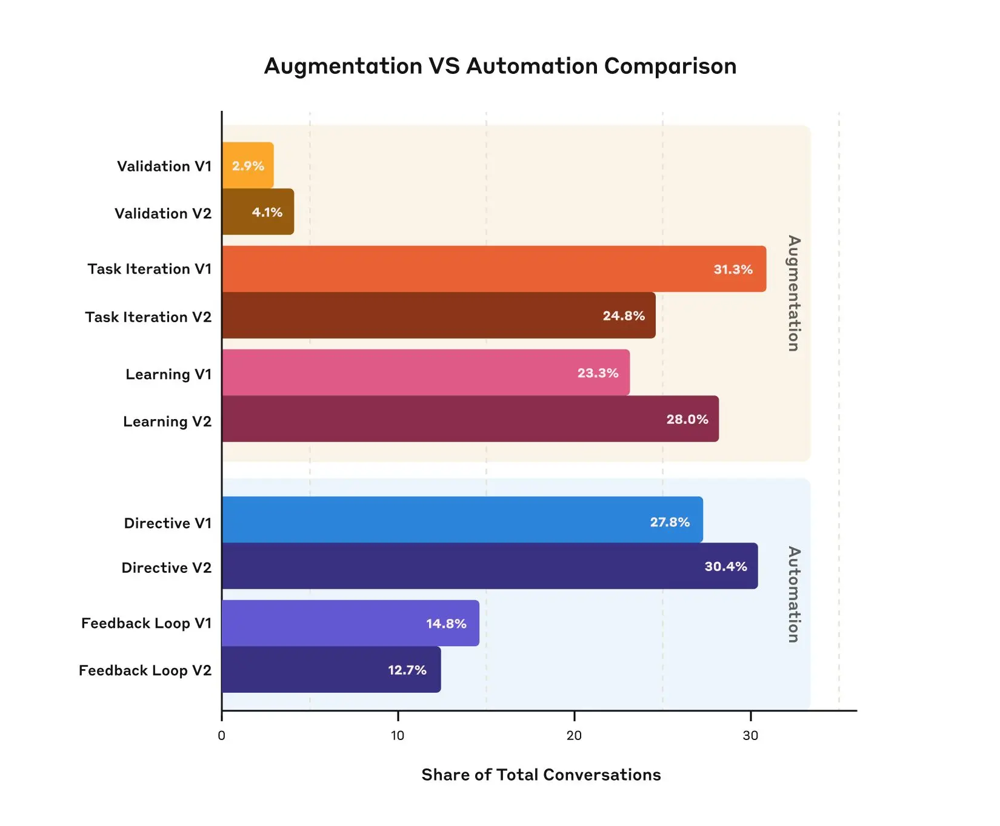
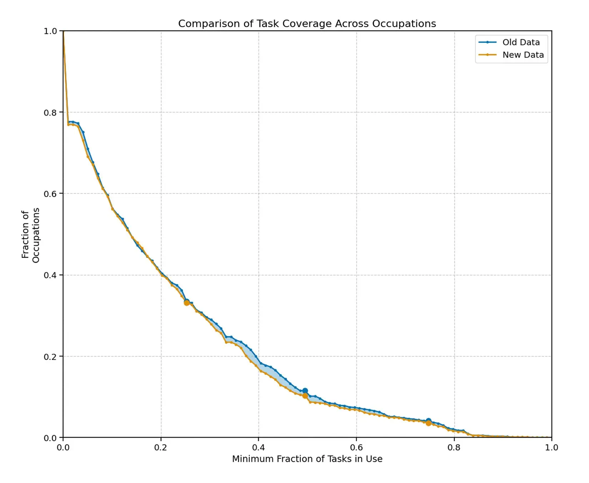

<!-- more -->

# Agents, Planning, Evaluation and AI Index Reports 2025

I recently compiled a reading list of a few articles, reports and interesting content to read as a single .pdf.

The highlights of this read were:

1. [Agents by Chip Huyen](https://huyenchip.com//2025/01/07/agents.html)
2. [A State of AI Report by McKinsey](https://www.mckinsey.com/capabilities/quantumblack/our-insights/the-state-of-ai#/)
3. [The Anthropic Economic Index for Claude 3.7 Sonnet](https://www.anthropic.com/news/anthropic-economic-index-insights-from-claude-sonnet-3-7)
4. [Anthropic Education Report: How University Students Use Claude](https://www.anthropic.com/news/anthropic-education-report-how-university-students-use-claude)
5. [Who Validates the Validators? Aligning LLM-Assisted Evaluation
of LLM Outputs with Human Preferences](https://arxiv.org/pdf/2404.12272)

If you want the full list of reads check out the compilation pdf I put up here:

[Download the full compilation here](https://automata-learning-lab.kit.com/264ab2f63e){ .md-button .md-button--primary }

Now, I want to write about the main insights from this read.

---

## Planning Failures, Evaluation and Tool Selection Tips

In [Huyen's amazing piece](https://huyenchip.com//2025/01/07/agents.html) she oulines a few things that for me are not obvious when it comes to thinking about agents, those are modes of planning failures in agents and tips for selecting tools.

### Planning Failures

Agents might fail in the following way:

1. Invalid tool - where the agent generates a plan with a tool that is not available.
2. Valid tool but invalid parameters - the agent generates a plan with an appropriate tool but it gives parameters to it in the wrong way (like the tool might accept 2 parameters and the agent gives it one).
3. Valid tool but invalid parameter values - Same as before but in this case the agent gives the right amount and type of parameters but these are just the incorrect values.
4. Goal failure - the agent might miss the task all together or not abive by the requirements properly. 

Interesting points about goal failure:
a. Taking too long - that sometimes the agent might solve a task, but it might take so long that this latency in itself is a failure (like missing a deadline).
b. Reflection failure - when the agent thinks it solved the task when it hasn't

### Evaluation for Planning Failures

To evaluate for planning failures one could generate a planning dataset where each example is a pair of task and tool inventory, where for each task the agent is used to generate a certain number of plans and then compute some interesting metrics:

1. Out of all generated plans, how many are valid?
2. For a given task, how many plans does the agent have to generate to get a valid plan?
3. Out of all tool calls, how many are valid?
4. How often are invalid tools called?
5. How often are valid tools called with invalid parameters?
6. How often are valid tools called with incorrect parameter values?

All of those attempt to find the quantifiable elements of this subjective problem of measuring performance for the planning capabilities of an agent. 

The idea here being that, when you analyze the agen'ts outputs for patterns you should look at things like: "What types of tasks does the agent fail more on?", any hypothesis as to why?. What tools does it fail more often?. 

One can improve an agent's ability to use hard tools by improving upon:

1. Prompting
2. Giving it more examples
3. Fine-tuning

### Tool Selection Tips

Chip Huyen's article gives these 4 cool tips for tool selection:

---

## Insights from EvalGen Paper

Luckly enough, despite my reading list being a somewhat random compilation of materials, I accidently put together 2 quite relevant reads back to back, Chip Huyen's Agent article and this really cool 2024 paper: ["Who Validates the Validators? Aligning LLM-Assisted Evaluation of LLM Outputs with Human Preferences"](https://arxiv.org/pdf/2404.12272). 

This paper is interesting because it takes on the challenge of looking at the subjective nature of "criteria" when addresssing LLM evaluation. They talk about this concept of "criteria drift" where when users face llm outputs that changes and refines the criteria for evaluating them altogether. 

To me it's interesting this idea that reviewing LLM outputs changes what users think the evaluation criteria should be. I guess it makes sense to think about criteria for what is a good output to be something dynamic and iterative rather than a rigid/written in stone definition.

From my ChatGPT conversations about this paper we came up with these insights from the paper:

??? note "EvalGen Paper Insights"
       1. 🔁 Evaluation Criteria Evolution

        **Core Finding:** Evaluation criteria are dynamic, not static. They evolve as reviewers encounter more LLM outputs.

        **Implication:** Build evaluation systems that support iterative refinement. Initial rubrics should be treated as starting points, not final standards. Expect early review cycles to reshape your understanding of quality.

       2. 🧠 Human Standards Development

        **Core Finding:** Humans develop evaluation norms through the review process itself.

        **Implication:** Design validation workflows (e.g., reflection agents, human-in-the-loop scoring) with calibration periods. Enable reviewers to co-develop standards rather than enforcing rigid rubrics from the start.

       3. 🔍 Output-Influenced Judgment
       
        **Core Finding:** LLM outputs directly influence how validators assess quality.

        **Implication:** Be mindful of feedback loops where validator criteria adapt to model behavior rather than external standards. Monitor for potential reinforcement of model quirks.

       4. 🧭 Transparency Over Consensus
       
        **Core Finding:** Task interpretation evolves through discussion, not just through right/wrong determinations.

        **Implication:** In multi-agent systems, prioritize surfacing reasoning and disagreements over achieving consensus. Build mechanisms to track why decisions are made.

       5. 📊 Tracking Subjectivity
       
        **Core Finding:** Evaluation inherently involves subjective judgment without absolute ground truth.

        **Implication:** Implement meta-evaluation tools (e.g., rationale recording, agent reflection prompts) to make subjectivity traceable and transparent.

## Insights from Anthropics Claude 3.7 Sonnet Economic Index

Anthropic has been putting out some awesome reports on AI usage. A recent one that was on my reading list for way too long was this:

[Anthropic Economic Index: Insights from Claude Sonnet 3.7](https://www.anthropic.com/news/anthropic-economic-index-insights-from-claude-sonnet-3-7)

In it they outline how different occupations use Claude 3.7 Sonnet and its new extended thinking mode.

The highlights of this article for me were:

**Increase in usage share** for math/coding and education but a decrease for arts and media! 

I think this decrease might relate to copywright infringement laws and overall distrust with big tech companies.

Image taken from: [Anthropic Economic Index: Insights from Claude Sonnet 3.7](https://www.anthropic.com/news/anthropic-economic-index-insights-from-claude-sonnet-3-7)  

**Increase in learning usage** (a type categorized as augmentation) but also an increase in directive usage (when you ask for what you want directly) in the automation group + a decrease in task iteration

Image taken from: [Anthropic Economic Index: Insights from Claude Sonnet 3.7](https://www.anthropic.com/news/anthropic-economic-index-insights-from-claude-sonnet-3-7)  

In my head this could be explained as:

    a. Increase in learning usage because people are learning about the powers of models now and starting to use it (I know so many people that don't use the top models and think we are still in 2022...)

    b. Increase in directive usage might be a mix of people getting lazier and trusting more the powerful models coming out

    c. Decrease in task iteration I associate with the overall improvement in the quality of the models as a whole

**IT people use it** the most for feedback loops (no surprises here...)

**Copy writers and editors use it the most for task iteration** - I thought software engineers were going to win this one...

**Most occupations are using AI in only a small share of their tasks.**

Image taken from: [Anthropic Economic Index: Insights from Claude Sonnet 3.7](https://www.anthropic.com/news/anthropic-economic-index-insights-from-claude-sonnet-3-7)  

I had to double check with ChatGPT this one, but in this graph they coined "depth of task usage" they plot the minimum fraction of tasks in use on the x-axis and the % of occupations on the y-axis, showing that AI usage is still reserved for a small share of tasks across most occupations, which I think is a mix of being early still and the adaptation to this new worklow takes some adjustment.