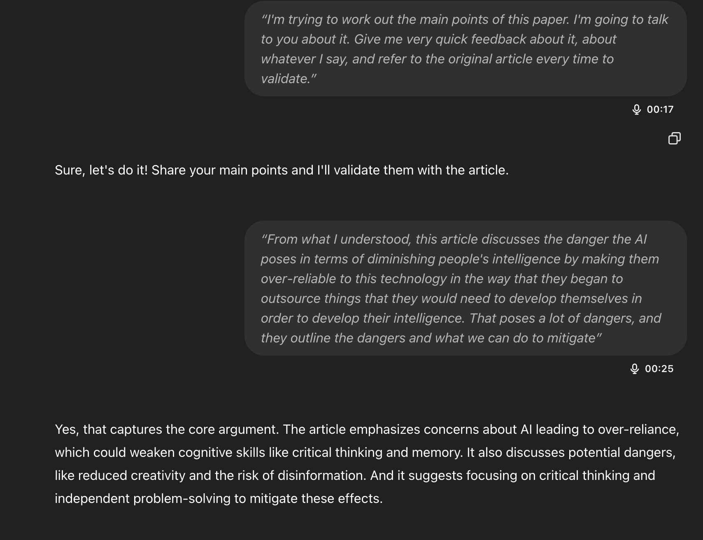
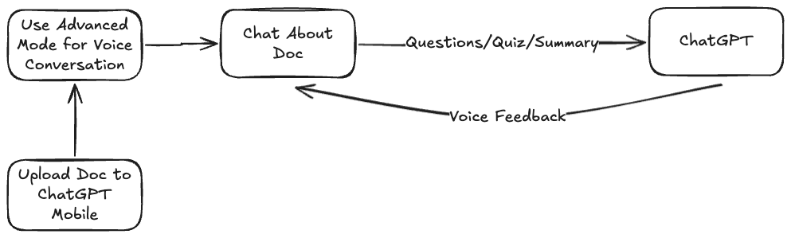
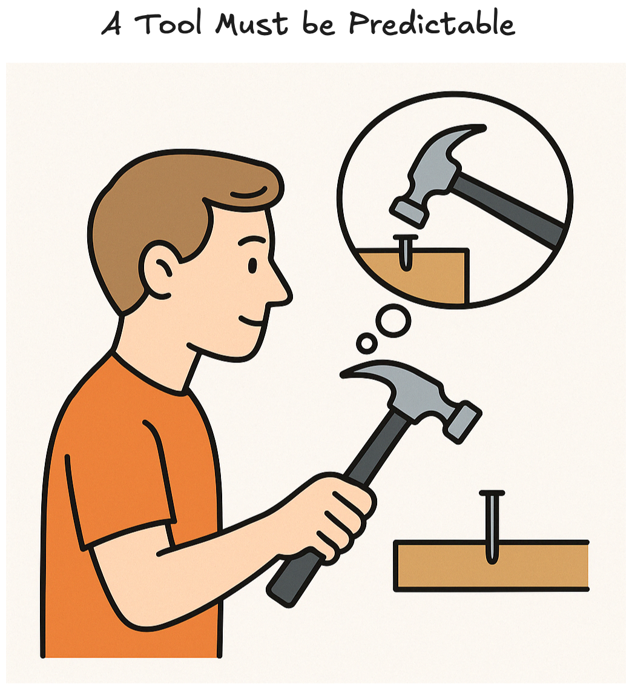
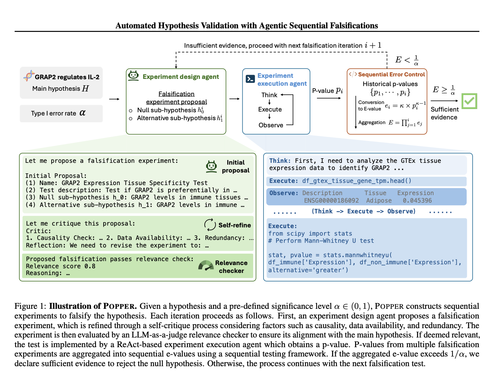

---

title: AI Tools for Learning, Studying and Research
date: 2025-04-20

# AI Tools for Learning, Studying and Research
---

<!-- more -->

## Goal

*In this piece I go over thoughts and techniques for applying AI tools to learning, studying and academic research workflows.*

## Fuzzy Principles for Applying AI Tools to Learn Stuff

My view on the topic of using AI to learn and study is:

- You can **only learn effectively by applying focused and intentional effort** into something

- The amount you trully learn is correlated with how much intentional effort you put into it, **that HAS NOT CHANGED WITH AI**

- What has changed is that **now we have tools to boost the efficiency of the time we spend on something** intentionally

- The problem, when it comes to AI usage, is that **it's use invites bad habits** and incentivizes too much cognitive offloading,
which can inherently lead to less learning.

- So **if you use AI in such a way where you become less intentional and put in less mental effort, you learn less, but if you use it right, and you can self-regulate the impulse to offload too much to AI, you can learn a whole lot**.

- **Intelligent offloading to AI is a critical meta skill in the new age**


*[Image generated with GPT-4o](https://chatgpt.com/)*

??? note "Example Bad and Good Prompts"
      | Bad Prompt | Good Prompt |
      |------------|-------------|
      | Write me an essay about:{X} | I'm working on this essay about {X} I got stuck on this part regarding {Y} because I can't seem to find a perspective/angle on it, can you suggest 3 ways to get me unstuck? |
      | | I want to write an essay about {X} but I don't have any background knowledge on the topic, which questions should I be asking to get started? |
      | | Can you take a look at this essay I wrote: {ESSAY INPUT} and give me feedback on it based on these materials I'm working through: {MATERIALS}? Write the feedback as instructive and actionable bullet points. |
      | I have this coding problem: {PROBLEM INPUT} write the code to fix it: | I'm trying to figure out this coding problem: {PROBLEM INPUT}, can you identify what am I doing wrong and explain it without code? |
      | | I got stuck in this coding problem: {PROBLEM INPUT} can you break down the solution into questions and ask them 1 by one so I can figure out the solution by myself? Write each as an individual bullet point. |
      | Summarize this article in simple terms: {FULL ARTICLE} | I read this article: {FULL ARTICLE} and this is what I understood: {YOUR OWN SUMMARY OF THE ARTICLE}, can you identify things I missed? |
      | | I'm studying this: {YOUR STUDY TOPIC}. Extract the main insights from this article: {FULL ARTICLE} that relate to my research and provide quotes that validate each insight. |

The examples outlined below showcase this idea of striving for learning through active engagement and critical dialogue where rather than accept blindly whatever the AI gives you, you stop to reflect, ask for follow ups, question it , and so on.

The idea is that **by understanding the dangers, we can strive to mitigate its negative effects** and learn a healthy path towards trully better learning with AI.

An amazing piece on this topic if you're interested is in [this piece by "The Guardian"](https://www.theguardian.com/technology/2025/apr/19/dont-ask-what-ai-can-do-for-us-ask-what-it-is-doing-to-us-are-chatgpt-and-co-harming-human-intelligence?utm_source=chatgpt.com).

I also like this piece from the ["The Stanford Daily" by Divya Ganesan](https://stanforddaily.com/2025/04/06/ganesan-how-to-be-an-ai-student/) discussing how one can avoid the "AI temptation zones" and use AI as a tool for critical thinking.

Funny thing is that after listening to this article while walking on the park I did a little AI session on it which I think exemplifies perfectly the type
of AI usage I want to advocate for, you can check that out [here](../assets/ai-impact-intelligence.html).

## Some Fake Math To Back It Up

If before you spent an hour to learn X amount of information and knowledge, now you can spend that same hour with same intentional effort to learn p * X where p is a multiplier associated with proper usage of technological tools. 

However there is a catch, if poorly used, AI tools can undermine learning by creating these dangerous incentives towards things like guess and check approaches or copy pasting essays and so on.


To put it in some fake math terms:

<div style="background-color: #f8f9fa; padding: 20px; border-radius: 8px; box-shadow: 0 2px 4px rgba(0,0,0,0.1);">
  <div style="text-align: center; margin-bottom: 20px;">
    <math xmlns="http://www.w3.org/1998/Math/MathML" style="font-size: 24px;">
      <mrow>
        <mtext style="color: #2c3e50; font-weight: bold;">Learning Output</mtext>
        <mo>=</mo>
        <mi style="color: #e74c3c;">p</mi>
        <mo>×</mo>
        <mi style="color: #3498db;">X</mi>
      </mrow>
    </math>
  </div>


  <div style="margin-left: 20px;">
    <p style="color: #2c3e50; margin: 10px 0;">
      <span style="color: #3498db; font-weight: bold;">X</span> is the baseline amount of information/knowledge learned in one hour
    </p>
    <p style="color: #2c3e50; margin: 10px 0;">
      <span style="color: #e74c3c; font-weight: bold;">p = f(proper tool usage)</span> is the efficiency multiplier from using AI tools effectively
    </p>
    <p style="color: #2c3e50; margin: 10px 0;">
      <span style="color: #e74c3c; font-weight: bold;">p > 1</span> when AI tools are used properly
    </p>
    <p style="color: #2c3e50; margin: 10px 0;">
      <span style="color: #e74c3c; font-weight: bold;">p = 1</span> represents traditional learning without AI tools
    </p>
    <p style="color: #2c3e50; margin: 10px 0;">
      <span style="color: #e74c3c; font-weight: bold;">p → ?</span> represents the degradation of learning when AI tools are misused, creating perverse incentives that can undermine knowledge acquisition
    </p>
  </div>
</div>

<!-- Note: The efficiency multiplier p might actually be dependent on X itself, as different subjects and topics have varying degrees of "AI-friendliness". For example, programming concepts might have a higher p than abstract philosophical concepts, as AI tools are generally better at handling concrete, structured information than abstract reasoning. This suggests that the relationship might be more accurately represented as p(X) rather than a constant p. -->


*Image generated by me! :)*

Note on this graph is that I don't mean learning is linear, I'm just arguing for the potential of efficient usage of AI.

Think about the fact that if you have time X to do task Y you can either waste it on watching say a full YouTube video from beginning to end, or you can take the video transcript, feed into AI and then extract exactly what you need with timestamp references to the relevant parts, so that you can directly tackle your problem rather than waste time with information you don't need.
Why would you not do it? There is a qualitative difference between that and asking AI to do your homework.

In my view, the goal is to: 

> Boost efficiency of the intentional effort we put in to learning anything by systematically addressing the pragmatic challenges and obstacles of each of proper strategic use of AI for learning, studying and research

## Practical Definitions & Tooling Landscape

??? note "AI & LLM Terminology"
    ??? note "Core Concepts"
        - AI Tool: Software that exposes one or more AI models via UI or API to perform tasks (e.g., text generation, summarization, image creation).
        - Model: A trained neural network that maps inputs to outputs (e.g., text → text, image → caption).
        - LLM (Large Language Model): A transformer‑based model (often billions of parameters) that predicts and generates text token by token.
        - Transformer: Neural architecture using self‑attention to capture dependencies across a sequence; backbone of modern LLMs.
        - Token: Discrete unit of text (word piece, character) that the model processes; vocabulary element.
        - Context Window: Maximum number of tokens the model can "see" in one call; sets the input+output limit.
        - Prompt: User‑provided text (and instructions) that conditions the model's output.
        - Prompt Engineering: Crafting prompts (templates, examples) to steer model behavior and improve output quality.

    ??? note "Advanced Concepts"
        - Zero‑/Few‑Shot: Prompting without (zero‑) or with a small set of examples (few‑shot) to teach the model a task.
        - Embedding: Fixed‑length vector representing text (or images) in continuous space, used for similarity and retrieval. <span style="color: red">?</span>
        - Retrieval‑Augmented Generation (RAG): Technique that retrieves relevant documents via embeddings and feeds them into the LLM to ground its answers. <span style="color: red">?</span>
        - Agent: Script or workflow that chains multiple prompts, API calls, or tools (search, calculator) to perform complex tasks. <span style="color: red">?</span>
        - Structured Output: Constraining model responses into predefined formats (JSON, tables) for reliable parsing and downstream use.
        - Hallucination: Model's confident but incorrect or fabricated information; mitigated by grounding, citations, or checks. <span style="color: red">?</span>
        - Inference: The act of running the model on new inputs to produce outputs. <span style="color: red">?</span>
        - API Call: Programmatic request to an AI service, submitting prompt and receiving model output. <span style="color: red">?</span>

??? note "AI Tooling Landscape"
      - ChatGPT
          - Custom GPT (or Custom Assistant): User‑configured agent built via templates or fine‑tuning to automate repeatable workflows. <span style="color: red">?</span>
          - Projects
          - Canvas
      - Claude
          - Artifacts
          - Projects
      - Gemini
      - Llama
      - Perplexity
      - Elicit
      - DeepSeek
      - Ollama
      - NotebookLM


## Foundational Tool Skills

Hopefully at this point you're convinced there is a good way to use AI, so the question is now how?
To address this let's start by the tools we need and the skills we aim to develop:

- Prompting (ChatGPT, Claude, Gemini, Llama, Deep Seek)
  - CRE Framework for ChatGPT prompting
  - Practical Approach to Prompting
  - Prompt Templating
  - Prompt Improvers like anthropic console's prompt improver

- Image Generation

- Deep Research

- Prompt management tools

<span style="color: red">After finishing come back and see which were the tools used in fact</span>

## Foundational 'Meta-Skills'
- Meta-usage 
  - Clarifying
  - Learning to ask for questions
  - Planning with reasoning LLMs

<span style="color: red">After finishing come back and see which were the meta stuff addressed</span>

## Learning

To serve a practical end we'll discuss learning as this navigation through the layers of [the Bloom Taxonomy](https://eclass.uoa.gr/modules/document/file.php/PPP242/Benjamin%20S.%20Bloom%20-%20Taxonomy%20of%20Educational%20Objectives%2C%20Handbook%201_%20Cognitive%20Domain-Addison%20Wesley%20Publishing%20Company%20%281956%29.pdf).

??? note "Bloom Taxonomy"
    Bloom's Taxonomy was first articulated in the mid‑20th century as a systematic classification of educational objectives, laying the foundation for decades of instructional design and assessment practices. The original concept emerged from a committee of educators chaired by Benjamin S. Bloom and was codified in a handbook focused on the cognitive domain. This seminal work not only defined six hierarchical levels of cognitive processes but also established parallel frameworks for affective and psychomotor domains, profoundly shaping how learning outcomes are written and evaluated.

    Sources: 
        - `Bloom, B. S., Engelhart, M. D., Furst, E. J., Hill, W. H., & Krathwohl, D. R. (1956). Taxonomy of Educational Objectives: The Classification of Educational Goals – Handbook I: Cognitive Domain. London: Longmans.`


*[Image Generated by the author inspired by Bloom 1956](https://eclass.uoa.gr/modules/document/file.php/PPP242/Benjamin%20S.%20Bloom%20-%20Taxonomy%20of%20Educational%20Objectives%2C%20Handbook%201_%20Cognitive%20Domain-Addison%20Wesley%20Publishing%20Company%20%281956%29.pdf)*

The Bloom Taxonomy is a systematic classification of educational objectives that outlines 6 hierarchical levels of cognitive processes:

- Remembering
- Understanding
- Applying
- Analysing
- Evaluating
- Creating

Essentially, I want to discuss how we can effectively leverage AI to improve, accelerate and boost the efficiency of each of these learning stages. I also want to emphasize that the bridge I am making here is not scientific, its merely practical, giving us a useful theoretical foundation with which we can work.

For each of these I want to provide some workable definition of what we're trying to achieve,
and then go on to techniques, tips and effective strategies for using AI to navigate each of these stages.

---

### Remembering

**For this stage what we want is to have a system to ensure we remember whatever we want.** 

My favorite article on this topic is from the legendary [Michael Nielsen: 'Augmenting Long Term Memory'](https://augmentingcognition.com/ltm.html)
where he outlines his preference and interest for [anki flashcards](https://apps.ankiweb.net/#download).

??? note "Summary of Augmented Long Term Memory"
    - **Memory is leverage** – Spaced‑repetition cuts the lifetime review cost of a fact from ~2 h (paper flashcards) to **4‑7 min**, making recall a *choice* instead of luck.  
    - **Anki’s core mechanic** – After every correct answer, the interval before the next review grows (≈×2.4). A failure resets the card, enforcing “desirable difficulty”.
    - **Create cards while creating things** – Extract questions from papers, code, conversations or experiments you’re *actively* working on; skip “just‑in‑case” trivia to avoid orphan cards.
    - **Atomic questions > fuzzy prompts** – One idea per card, no yes/no framing; split big facts into multiple Cloze/Q‑A cards for sharper recall.
    - **One deck, mixed domains** – Tags are fine, but reviewing everything together keeps sessions short (10‑20 min/day) and sparks cross‑domain associations.
    - **Retrieval first, re‑reading last** – Regular testing at the edge of forgetting strengthens memory far more than rereading notes; convert frequent ChatGPT errors into new cards.
    - **Declarative ↔ procedural bridge** – SRS primes commands, formulas and language; cement them by performing a real micro‑task right after review.
    - **Cognitive backdrop** – Builds on the Ebbinghaus forgetting curve and distributed‑practice research: spaced tests flatten the decay curve and enlarge working‑memory “chunks”, accelerating higher‑order thinking.
    - **Keep the setup simple** – Vanilla Anki (Q‑A + Cloze) delivers 95 % of the value; chase plugins and automation *after* the habit sticks.
    
    Source: [Augmenting Long-term Memory](https://augmentingcognition.com/ltm.html)

To follow along you should have some flashcard software that you can use, I recommend [Anki Flashcards](https://apps.ankiweb.net/#download), but
similar approaches can be achieved with any other.

I love anki flashcards so here we go. Let's talk about some techniques I use on a weekly basis to help memorize all sorts of information.

#### 1. From ChatGPT Chat to Anki

**Prompt:**

```
'Create {{PUT AMOUNT OF CARDS}} anki flashcards for the content below in the format:

    ''''''<front content>;<back content>''''''.

    Try to capture all the main information and craft cards that can encode that effectively.


{{PASTE CONTENT TO ANKIFY}}
```

**Expected Output**

```
# For any conversation when there are more than just a few facts I want to memorize I use this prompt 
# to just generate a simple .txt file with the structure you see below
back question1 ;front answer 1
back question2 ;front answer 2
....
```

Which allows me to upload them directly to anki in bulk instead of having to create individual
cards, imagine having to study for a biology exam and having to write all the cards yourself.

My pro tip is to not go crazy trying to ankify everything because that can
lead to a lot of inneficient studying down the line, but to **cultivate
a skill of learnign what you should memorize**, and then using AI to facilitate the
process when you have to memorize a lot of stuff from the same source.

#### 2. Quiz From {Source}

Beyond just creating flashcards, you need to actually practice retrieval,
given that at this stage is pretty much stablished that retrieval works
quite well if done right. 

??? note "Effectiveness of Retrieval Practice on Knowledge Retention"
    Retrieval practice, or self-testing, has been shown to be an effective
    strategy for enhancing learning and retention across various academic
    disciplines (Richmond et al., 2022; Maddox & Balota, 2015). Both overt
    and covert retrieval practice can benefit retention equally
    (Smith et al., 2013). The effectiveness of retrieval practice may be
    influenced by factors such as spacing (Maddox & Balota, 2015), timing
    (Matayoshi et al., 2020), and the difficulty of retrieval
    (Greving et al., 2020). However, some studies have found mixed results,
    with one study in a MOOC environment showing no significant effect of
    retrieval practice (Davis et al., 2018). Importantly, when given control
    over their learning, students often fail to utilize retrieval practice
    effectively, leading to poor retention (Karpicke, 2009). Retrieval
    practice can improve both higher- and lower-level thinking
    (Richmond et al., 2022) and enhance subsequent encoding during study
    (Karpicke, 2009). Additionally, retrieval practice can benefit the
    accuracy of self-assessment and overall test performance (Pilotti et al., 2009).
    
    Source: [Elicit quick research report](https://elicit.com/notebook/c2a4cb6f-7c9e-45f8-8ea5-9fb08998d030)

For quizzes what I like to do is literally ask ChatGPT/Claude/Gemini to quiz me on topic X,
usually quizzing yourself directly on the chat can be useful as a kind of screening
stage for the stuff you tend to forget, and for which you could potentially 
create anki cards for.

Prompt:

```
I am studying for {DESCRIBE THE CONTEXT OF YOUR QUIZ} and I want you 
to quiz me on this content:
{PASTE THE CONTENT YOU WANT TO BE QUIZZED ON LIKE A PDF}

Ask me 3 questions at a time and wait for my reply before providing feedback.
```

The pro tip here is to be very customizable regarding how your quizzed and 
the nature and format of the questions and the feedback you expect to get.

??? note "Custom Specialized Prompts for the Remembering Stage"
        1 — Rapid‑Fire Recall Quiz
        Prompt template
        “Ask me 10 single‑sentence questions that simply check whether I can name, define or list key points about <topic>. After each answer I give, tell me immediately if I’m right, supply the correct answer if needed, then move to the next question. End with a scoreboard.”

        Why it works – immediate feedback plus spacing; uses “name/define/list” verbs tied to the remembering tier.​
        [Whatfix](https://whatfix.com/blog/blooms-taxonomy/?utm_source=chatgpt.com)
        [Tips at UARK](https://tips.uark.edu/blooms-taxonomy-verb-chart/?utm_source=chatgpt.com)

        2 — Cloze‑Deletion Flashcards
        Prompt template
        “Create 20 cloze‑deletion cards (Anki‑style ‘fill‑in‑the‑blank’) for the most testable facts about <topic>. Return them as a two‑column table: Front (sentence with […] blank) | Back (missing word).”

        Cloze cards force lexical recall, not mere recognition, while tables paste straight into flashcard apps.​
        [TeachThought](https://www.teachthought.com/critical-thinking/question-stems/?utm_source=chatgpt.com)
        [Salisbury University](https://www.salisbury.edu/administration/academic-affairs/instructional-design-delivery/articles/blooms-taxonomy-action-verbs.aspx?utm_source=chatgpt.com)

        3 — Definition‑Matching Grid
        Prompt template
        “Give me a shuffled list of 15 terms and 15 concise definitions for <topic> in two separate numbered columns so I can draw lines or use drag‑and‑drop tools to match them.”

        Matching is a classic remember‑level activity and the two‑column format plugs into digital worksheet generators.​
        [ThoughtCo](https://www.thoughtco.com/blooms-taxonomy-questions-7598?utm_source=chatgpt.com)
        [Utica University](https://www.utica.edu/academic/Assessment/new/Blooms%20Taxonomy%20-%20Best.pdf?utm_source=chatgpt.com)

        4 — Memory‑Palace Hooks
        Prompt template
        “For each core fact I must memorize about <topic>, produce: 1) the fact in one sentence; 2) a vivid, quirky image I can visualize in a memory‑palace room; 3) a one‑word cue. Limit to 12 items.”

        Adds imagery to raw recall, strengthening encoding while staying inside the “remember” objective.​
        worldofinsights.co
        [Whatfix](https://whatfix.com/blog/blooms-taxonomy/?utm_source=chatgpt.com)

        5 — 1‑Minute “Dump” Drill Generator
        Prompt template
        “Give me a prompt that tells me to write down (from memory, no peeking) everything I know about <topic> for exactly 60 seconds, then supply the authoritative list so I can compare gaps.”

        The timed free‑recall (“brain dump”) pushes retrieval fluency; comparing to the model answer highlights omissions.​


#### 3. Quizzing with Quotes

When quizzing yourself with a PDF for example the #1 tip is for any statement given ask for a 'quote that validates it', for example

??? note "Prompt for Quizzing with Quotes"
      ```
      Prompt:
      You are an expert instructional‑designer.

      I will paste text from a PDF (any length, possibly in chunks).  
      Create **higher‑order multiple‑choice questions** that check genuine comprehension (analysis, causation, implications, synthesis).

      **Format your reply exactly like this (no JSON, no extra commentary):**

      1. **[Question]**  
        A) …  
        B) …  
        C) …  
        D) …  

      THE OUTPUTS LIKE BELOW SHOULD BE PROVIDED AFTER GETTING THE USER's answer FIRST:
        **Answer:** C  
        **Supporting quote (page #, paragraph #):** “Exact ≤ 40‑word excerpt that proves the correct answer.”

      2. **[Question]**  
        …

      …and so on until the user says STOP, or asks for modifications on the quiz.

      **Rules**

      - Choices must be plausible, mutually exclusive, and cover common misconceptions.  
      - Do **not** repeat wording from the stem in the correct choice.  
      - Draw questions from across the whole document so every main section is tested.  
      - Quotes: copy verbatim—including punctuation—from the PDF; shorten with ellipses only if necessary for brevity.  
      - Do **not** provide quotes for wrong choices or add explanations besides the single supporting quote.  
      - Keep the presentation clean—just the numbered list above, nothing else.
      - Ask ONE QUESTION at a time, wait for answer, then give rich FEEDBACK and move to the next question
      ```
      Example output:
      
      *Screenshot take from https://chatgpt.com/*

#### 4. Summarize with References to Sources

You can also ask for summaries that refer to the original source for quick reference and validation:

```
Prompt: 
Summarize the following content in a format that presents a bullet point followed by a related key quote to illustrate each summarized bullet point:

{{ SOURCE CONTENT LIKE A PDF }}
```

You can do the same even with Youtube videos:

```
Prompt:
Summarize this Youtube video the transcript is below:
{INPUT YOUTUBE TRANSCRIPT}
Now the summary should be about the main topics discussed
regarding algebraic topology and the structure of the summary
should follow:

'''
1. {Core idea explanation}
- youtube link refering to the timestamp that validates the idea

2. {Core idea explanation}
- youtube link refering to the timestamp that validates the idea
etc...
'''

to create the youtube links with the right timestamps consider this is the link for the original video:
{INPUT YOUTUBE LINK}
```

#### 5. AI-Powered Search for Validation of Summarized Information Access

When you're quizzing yourself or creating flashcards, obviously you need to make sure that the information holds,
to guarantee that you can use AI-powered search to validate sources for questions and information that you think might not
be as widely available online.

You can leverage search + smart prompting to [create flashcards that accompany sources](https://chatgpt.com/share/680775e9-8288-8004-b386-f2238141297b).

Search should also serve as validation specially for topics you think might be less available online and therefore the model's training
might not be able to properly prepare the model to respond.

```markdown
  Prompt:
  'Create {NUMBER OF CARDS} anki flashcards for the content below in the format:

      ''''''<front content>;<back content>;source as link if available or reference to doc title or origin''''''.

      Try to capture all the main information and craft cards that can encode that effectively.


  content:
  {INPUT RAW CONTENT}

  Make sure to: 
  {INPUT ANY CUSTOM INSTRUCTIONS}
```


#### 6. Leverage Image Generation for Memorizing Procedures

Now, beyond just prompting we can leverage other generative capabilities of AI models to complement 
memorization of specific types of information or processes. For example, one thing I like to do is
to leverage GPT-4o image generation for memorizing procedures.

```markdown
Prompt:
{INPUT RECIPE/PROCEDURE WITH CONCRETE STEPS}

Can you Create a helpful visual to help me remember this ?
Make sure to include
1. All the ingredients
2. All the instruction steps through relevant imagery 
3. Make it a like in a graphic novel like style
```


*[Image generated with GPT-4o](https://chatgpt.com/)*


You can check out the full conversation with ChatGPT [here](https://chatgpt.com/share/6808d0aa-21a0-8004-b1d6-a9a297c32cbd).

#### Tips for Better Remebering with AI

- Never generate cards blindly, if you don't have agency over the process you might recall some facts but won't be able to integrate that into anything
- Don't try to memorize too much at first, get an overview first by chatting with the model about the topic of interest
- Leverage [Programmable Attention](https://notes.andymatuschak.org/Programmable_attention)

??? note "Programmable attention and priming"
    Programmable attention, a concept explored by Andy Matuschak, refers to systems that dynamically guide your focus over time, automating the scheduling of small tasks—like flashcard reviews or creative exercises—to optimize learning and productivity. Tools such as spaced repetition systems (e.g., Anki, Orbit) exemplify this by managing when and what you review, reducing cognitive load and enhancing retention. This approach extends beyond memorization to support creative work and habit formation, integrating with practices like evergreen notes to foster sustained intellectual development.
    
    Source: https://notes.andymatuschak.org/Programmable_attention 


### Understanding

- Start off with basic brainstorming - [example chat](../assets/ai-impact-intelligence.html)


- Explain it back

Informal (spoken) version
  Example from chat:
  


Formal version

```
Prompt
I am analyzing a specific article and want to extract and understand its main points. I will share my thoughts with you one at a time. For each thought I share:

Give me immediate and concise feedback.

Refer explicitly to the original article to validate or correct what I’ve said.

Keep your responses focused and factual, pointing out where my interpretation aligns with or diverges from the text.
```

- Compare & Contrast
```
Prompt
I'm studying {X} Prompt me to write a 100‑word paragraph comparing and contrasting {CONCEPT A} and {CONCEPT B}, focusing on purpose, process and outcome. After I answer, supply your own comparison with a three‑bullet improvement checklist.
```

??? note "More Prompts for Understanding"
      Differentiate between A and B
      ```
      Prompt:
      Task 1 (60 s, no notes): List at least three key ways that <concept A> and <concept B> differ in purpose, structure and outcome.
      Task 2: When I’m done, show a concise comparison table (rows = dimensions; cols = A vs B) and highlight any distinctions I missed or got wrong.
      ```
      Quick example
      ```Replace the placeholders with mitosis vs meiosis (biology) or traditional budgeting vs zero-based budgeting (finance).```
      Identify the main idea of X
      ```
      Prompt:
      Give me a 120-word, expert-level paragraph on <topic>. Instruct me to rewrite the single, 
      clear main idea in ≤20 words without looking back. After my answer, display the
      authoritative main-idea sentence and emphasise any concepts I omitted.
      ```
      Quick example
      ```Topic could be the Doppler effect (physics) or Maslow’s hierarchy of needs (psychology).```
      Explain “Why did …?”
      ```
      Prompt: 
      Ask me: ‘Why did <event/process> happen, and what were its two most significant consequences?’
      After I answer (max 150 words), provide a model explanation organised as Cause → Mechanism → Effect 1 & 2, and underline any causal links I missed.
      ```
      Quick example
      ```Fill with Why did the Berlin Wall fall in 1989? or Why does increasing enzyme temperature accelerate then inhibit reactions?```
      
      Paraphrasing short chunks of large materials
      ```
      Prompt
      “Give me a short authoritative paragraph (≈120 words) about {TOPIC}. Tell me to paraphrase it in my own words without looking back. Then display both texts side‑by‑side and flag any ideas I dropped or distorted.”
      ```
      Quick Example
      ```"Give me a short authoritative paragraph (≈120 words) about the process of photosynthesis. Tell me to paraphrase it in my own words without looking back. Then display both texts side‑by‑side and flag any ideas I dropped or distorted."```
      


### Applying

The Applying stage focuses on using knowledge in practical contexts, requiring students to demonstrate understanding 
through concrete examples, exercises, and real-world applications.


??? note "Applying Stage Prompts"
    ### Examples & Application

    ### Experimentation
    ```
    Prompt: Give me an idea for an experiment I could do to test
    my knowledge of {X}.
    ```
    ```
    Prompt: "Generate 3 concrete examples of how <concept> applies in real-world scenarios. 
    For each example, explain how it demonstrates the core principles
    of {INPUT YOUR TOPIC OF FOCUS}
    ```
    
    ### Exercises
    ```
    Prompt: "Create 5 exercises I can use to practice skill {X}."
    ```
    
    ### Study Guide Creation
    ```
    Prompt: "Create a comprehensive study guide for {TOPIC} that includes:
    - Key concepts and definitions
    - Practical examples
    - Common misconceptions
    - Practice questions
    - Real-world applications"
    ```
    
    ### Contextual Feedback
    ```
    Prompt: "Review my understanding of {CONCEPT} and provide feedback that:
    1. Acknowledges my current level of understanding
    2. Points out specific areas for improvement
    3. Suggests practical ways to apply this knowledge"
    ```
    
    ### Analysis of Mechanisms
    ```
    Prompt: "Explain why {PROCESS/CONCEPT} works the way it does, breaking down:
    4. The underlying principles
    5. The cause-and-effect relationships
    6. The practical implications"
    ```
    
    ### Modification & Adaptation
    ```
    Prompt: "How would you modify {PROCESS/SYSTEM} to achieve {SPECIFIC GOAL}? 
    Consider:
    7. Current limitations
    8. Required changes
    9. Potential impacts"
    ```
    
    ### Instruction Development
    ```
    Prompt: "Create a step-by-step guide for {PROCESS/TASK} that:
    10. Is clear and actionable
    11. Includes important precautions
    12. Provides examples for each step"
    ```


### Analysing & Synthesizing

??? note "Prompts for Analysis and Synthesis"
      Summary
      ```
      Prompt
      You are an expert content summarizer. You take content in and output a Markdown formatted summary using the format below.

      OUTPUT SECTIONS
      Combine all of your understanding of the content into a single, 20-word sentence in a section called ONE SENTENCE SUMMARY:.

      Output the 10 most important points of the content as a list with no more than 16 words per point into a section called MAIN POINTS:.

      Output a list of the 5 best takeaways from the content in a section called TAKEAWAYS:.

      OUTPUT INSTRUCTIONS
      Create the output using the formatting above.
      You only output human readable Markdown.
      Output numbered lists, not bullets.
      Do not output warnings or notes—just the requested sections.
      Do not repeat items in the output sections.
      Do not start items with the same opening words.
      ```
      This example was adapted from [here](https://github.com/danielmiessler/fabric/blob/main/patterns/summarize/system.md)

      Weighing Factors
      ```
      Prompt
      I read this: {CONTENT} and for this context: {CONTEXT DESCRIPTION}
      these are the factors I consider to be relevant along with a 1-5 score for their importance {INPUT YOUR OWN FACTOR RANKING},
      give me feedback on this by contrasting with your own and organizing everything into a table.
      ```

      Contrasting Perspectives
      ```
      Prompt
      Given context {CONTEXT} I think {YOUR PERSPECTIVE} take an opposing view and argue with me helping me flush out arguments and ideas.
      Let's work through small debating sessions focused on one topic at a time.
      ```

      Re-framing (Contrasting & Reflecting)
      
      Prompt  
      ```
      I’ll paste a {TEXT_TYPE} on {TOPIC}.  

      • First, **I** will rewrite {NUM_PARAGRAPHS} paragraphs from the perspective of a {LENS_A}; you *only* respond with probing questions that test my framing.  

      • After my revision, **you** produce your own {LENS_A} version **and** a {LENS_B} version, noting three framing shifts between them.  

      • End with one question that forces me to choose which lens better serves my purpose.
      ```

      **Placeholder guide**

      | Placeholder | What to insert | Example |
      |-------------|----------------|---------|
      | `{TEXT_TYPE}` | Kind of source you’ll paste | *policy brief*, *lab report*, *news article* |
      | `{TOPIC}` | Subject matter | *urban housing*, *quantum computing* |
      | `{NUM_PARAGRAPHS}` | How much you’ll rewrite first | *two*, *one* |
      | `{LENS_A}` | First analytic lens or stakeholder view | *behavioural economist*, *UX designer* |
      | `{LENS_B}` | Second contrasting lens | *environmental activist*, *CFO* |


      Much fancier example [here](https://github.com/danielmiessler/fabric/blob/main/patterns/analyze_paper/system.md)


### Evaluating

??? note "Examples of Prompts for Evaluating Stage"
      
      **Agree / Disagree**

      ```
      Prompt

      I’m going to share a {STATEMENT} about {TOPIC}.

      • First, **I** decide whether I *agree* or *disagree* and give a brief rationale (≤ 100 words).  
      • You reply with  
        1. one probing question that tests my reasoning and  
        2. a concise counter‑position backed by one piece of {EVIDENCE_TYPE}.  

      Finish by asking me to revise or stand firm—and explain why.
      ```

      **Placeholder guide**

      | Placeholder     | Insert…                     | Example                                     |
      |-----------------|----------------------------|---------------------------------------------|
      | `{STATEMENT}`   | Claim / assertion          | Social media worsens teenage mental health. |
      | `{TOPIC}`       | Subject area               | adolescent psychology                       |
      | `{EVIDENCE_TYPE}` | Evidence style           | peer‑reviewed study                         |

      ---

      **Choosing the Best Option**

      ```
      Prompt
      I’ll paste {NUM_OPTIONS} candidate {OPTIONS_TYPE} for solving {PROBLEM}.

      • **I** will rank them best → worst and add a one‑sentence reason for each.  
      • You then  
        3. share your own ranking (mark any swaps with 🔄),  
        4. point out one criterion I overlooked and  
        5. ask how including that criterion might change my decision.
      ```

      **Placeholder guide**

      | Placeholder        | Insert…               | Example                    |
      |--------------------|-----------------------|----------------------------|
      | `{NUM_OPTIONS}`    | Number                | 3                          |
      | `{OPTIONS_TYPE}`   | Plans / tools / policies | marketing strategies    |
      | `{PROBLEM}`        | Challenge             | boosting newsletter engagement |

      ---

      **Determining the Most Effective Approach**

      ```
      Prompt
      I’ll provide three approaches ({APPROACH_A}, {APPROACH_B}, {APPROACH_C}) to achieve {GOAL}.

      • Build a comparison grid whose rows = evaluation criteria I list below.  
      • Leave the grid blank for me to score 1‑5.  
      • After I post my scores:  
        – add your own,  
        – highlight in **red** any criterion where we differ by ≥ 2 points and justify briefly,  
        – conclude with an evidence‑based verdict on the most effective approach.
      ```

      **Placeholder guide**

      | Placeholder           | Insert…                       | Example                                            |
      |-----------------------|-------------------------------|----------------------------------------------------|
      | `{APPROACH_A/B/C}`    | Method names                  | in‑house build / outsourced SaaS / open‑source stack |
      | `{GOAL}`              | Desired outcome               | deploying a data dashboard                         |

      ---

      **Opinion‑with‑Evidence**

      ```
      Prompt
      I’ll paste a question: {OPINION_QUESTION}.

      • **I** share my opinion plus at least two supporting reasons or pieces of evidence.  
      • You evaluate my support by  
        6. rating each reason for credibility (1‑5),  
        7. suggesting one stronger piece of {EVIDENCE_TYPE} and  
        8. asking a follow‑up that deepens the argument.
      ```

      **Placeholder guide**

      | Placeholder            | Insert…                          | Example                              |
      |------------------------|----------------------------------|--------------------------------------|
      | `{OPINION_QUESTION}`   | “What is your opinion…?” prompt | Should universities scrap final exams? |
      | `{EVIDENCE_TYPE}`      | Evidence style                   | longitudinal study                   |

      ---

      **How Would You Improve This?**

      ```
      Prompt
      I’ll paste a {WORK_SAMPLE} on {TOPIC}.

      • First, **I** list three concrete improvements.  
      • You then  
        9. score each suggestion for impact (★‑scale) and feasibility (💰‑scale),  
        10. offer one high‑leverage improvement I missed and  
        11. challenge me to draft an action plan for the highest‑impact item.
      ```

      **Placeholder guide**

      | Placeholder      | Insert…                         | Example            |
      |------------------|---------------------------------|--------------------|
      | `{WORK_SAMPLE}`  | Draft / design / code snippet   | executive summary  |
      | `{TOPIC}`        | Subject                         | sustainable packaging |

      ---

      **Stronger Argument**

      ```
      Prompt
      I’ll present two arguments ({ARG_A} vs {ARG_B}) about {ISSUE}.

      • **I** choose which is stronger and justify in ≤ 120 words.  
      • You respond by  
        12. steel‑manning the side I *didn’t* pick,  
        13. surfacing one hidden assumption in my reasoning and  
        14. asking whether revising that assumption alters my verdict.
      ```

      **Placeholder guide**

      | Placeholder           | Insert…                          | Example                                  |
      |-----------------------|----------------------------------|------------------------------------------|
      | `{ARG_A}` / `{ARG_B}` | Argument summaries               | pro vs con on remote work                |
      | `{ISSUE}`             | Debate topic                     | workplace productivity                   |

      ---


### Creating

??? note "Example Prompts for Creating"

    **Rapid Prototype Planner**

    ```
    Prompt
    I’ll describe a {RAW_IDEA} for a {PRODUCT_TYPE}.

    • First, **I** identify the core user need.  
    • You then  
      1.  outline a no‑code or low‑code way to test the idea in ≤ 3 steps,  
      2.  list one metric for each step to validate success and  
      3.  suggest one resource (tool, tutorial, template) to accelerate execution.
    ```

    **Placeholder guide**

    | Placeholder      | Insert…                       | Example                     |
    |------------------|-------------------------------|-----------------------------|
    | `{RAW_IDEA}`     | Concept / feature description | habit‑tracking app for ADHD |
    | `{PRODUCT_TYPE}` | Category                      | mobile app                  |

    ---

    **Story Remix**

    ```
    Prompt
    I’ll paste raw {FACTS} about {TOPIC}.

    • **I** note the target audience’s reading level.  
    • You respond by  
      4.  weaving the facts into a 4‑paragraph story arc (setup → conflict → climax → resolution),  
      5.  embedding an analogy and a vivid sensory detail and  
      6.  ending with a thought‑provoking question to spur reflection.
    ```

    **Placeholder guide**

    | Placeholder | Insert…              | Example                   |
    |-------------|----------------------|---------------------------|
    | `{FACTS}`   | Bullet list / notes  | climate change statistics |
    | `{TOPIC}`   | Subject              | polar ice melt            |

    ---

    **Teach‑Back Mini‑Course**

    ```
    Prompt
    I want to teach {SUBJECT} to {LEARNERS}.

    • **I** outline one constraint (time, format, prior knowledge).
    • You then  
      7.  draft a concise 3‑module syllabus,  
      8.  propose an interactive activity for each module and  
      9.  provide a quick formative assessment to measure learning gains.
    ```

    **Placeholder guide**

    | Placeholder   | Insert…              | Example              |
    |---------------|----------------------|----------------------|
    | `{SUBJECT}`   | Topic                | SQL joins            |
    | `{LEARNERS}`  | Audience description | bootcamp graduates   |

    ---

## Studying

In the start of this article I stated that learning effectively was correlated with the amount of intentional effort you put into it.
When discussing the effectiveness of studying I'll frame it as the process of getting the absolute most out of the intentional 
effort you put into studying whatever you want to learn. 

To do that I like to **treat studying as the skill of building practice**, where **practice means a closed loop with a clear feedback
where we can easily self-track our progress.**

To **build practice** with the help of AI tools I like constructing what I call `micro-flows`which essentially emcompass:

1. A simple loop with a learning goal
2. A set of concrete steps
3. Clear Outcomes

Ideally a micro-flow would involve:

4. A regular environment with predictable regularities
5. A concrete tangible feedback loop
6. A pipeline for gradually increasing challenges

These aim to foster what is known as the [*goldilocks principle*](https://journals.plos.org/plosone/article?id=10.1371/journal.pone.0036399) which in cognitive science and developmental psychology refers to this idea where people learn best when the material is neither too easy not too hard but 'just right'.

For example for studying pdfs the micro-flow might be:


*Image generated by me! :)*

These things I call micro-flows don't have to be rigid and strictly cover those elements, essentially they should be simple loops
of learning something with concrete outcomes adapted to the context of the student, for example a simple flow to prepare for a biology exam might look like:


*Image generated by me! :)*

Building these micro-flows is a skill, and I think that if developed correctly with the help of some strategically placed AI-powered
tools, one can become quite addicted to studying pretty much anything. Think about how musicians effectvely learn complex pieces by breaking those into small chunks and then practicing them, check out a nice video on this topic [here](https://www.youtube.com/watch?v=MNM0JOAJ0aI).

Building these micro-flows is not a result of you learning tool X or Y, its mostly about learning to identify how you as a learner does things, and which tools you're comfortable with, so that you can find that perfect middle ground that balances the tradeoff between the friction of learning new tools and ways of doing things with the knowledge and tooling you already have to get you to build flows that work perfectly for you. 


*[Image generated with GPT-4o](https://chatgpt.com/)*

What is really powerful about using AI is that now, a walk through the park can be a study session, I for example love reading papers and long web articles while walking around my neighbourhood in the morning. A flow that really works for me here is:



*Image generated by me! :)*

For example, for researching this article and for my workshop I spent one morning walking around and discussing this
[this article by "The Guardian"](https://www.theguardian.com/technology/2025/apr/19/dont-ask-what-ai-can-do-for-us-ask-what-it-is-doing-to-us-are-chatgpt-and-co-harming-human-intelligence?utm_source=chatgpt.com),
you can check out that conversation [here](../assets/ai-impact-intelligence.html).

What I like about this is that by framing studying as the process of going through these focused sessions I call 'micro-flows' you
learn this skill of developing more intelectual agency and ownership over the knowledge being acquired while leveraging technologies
to guarantee you don't waste time doing stuff that's not helping you progress.

Another micro-flow I like for language learning is:

1. Use ChatGPT Advanced Mode on the mobile app
2. I use a prompt like this: `You are a language tutor that speaks language {X} and {Y}, I'm learning language {X}, speak to me in this language and if I make a mistake correct me on that language unless I ask explicitly for you to explain it in language {Y}, start by asking me a random question.`
3. Chat with ChatGPT in my target language
4. Repeat

A slightly more advanced example involves asking Claude (I prefer Claude 3.7 Sonnet right now for code generation ) to generate 
a quiz app that I can run locally with pure html/javascript code that allows me to load a `.json` file and upload a structured quiz into it. Check out an [example chat for reference here](https://claude.ai/share/a4db28e4-6bc4-4255-9c2a-841553283c75).

??? note "Learning with AI Is Learning Self-Control"
      As we've discussed before learning properly with AI is directly related to your ability to self-control and contain the impulpse to outsource the wrong things to an LLM. However, that's easier said than done, given the an individual's energy levels throughout a day, week or month varies depending on a bunch of external factors, the fact that we can't necessarily have full control of these represents a significant danger in this self-regulatory battle. 

      What I mean is that, as our energy levels go down, the likelihood of outsourcing the wrong things to AI goes up, meaning that
      if you're tired, you have an exam coming up, you're not sleeping well, and you have to read say a 45 page manual on quantum mechanics,
      you may start asking for answers more than actually engaging with the material meaningfully.

      To prevent that it's important to develop through either daily logs or some serious self-talk a powerful sense of your internal state
      that allows you to know at any point in time wether or not you're progressing or if you're just fooling yourself with low quality 
      sessions, specially given that AI can produce this very powerful false impression of knowledge acquired through blind generation of information.

### A Tool Must Be Predictable

One thing I like about this idea of the micro flow is that it tackles one of the most salient flaws and weaknesses of AI tools, which is its undeterministic nature. Now by design, a tool to be useful must be predictable, meaning a person must have a very clear representation of the output it will get by using that tool. That's what gets us to use tools like hammers and keys and so on. However, due to the undeterministic nature of AI, sometimes it becomes quite challenging to understand how to use it. However, by inserting it into a micro flow where its undeterminism is put in check by having a loop of concrete outcomes, one can start to see the value of it.


*[Image generated with GPT-4o](https://chatgpt.com/)*

## Researching

We will assume that all of the items discussed below about learning and studying will obviously apply on how AI tools can be leveraged for research because a big part of doing research is about learning about the world and studying new things. So the point is to understand what is the unique challenge that academic research puts forward that must be addressed on the process of integrating AI tools into its workflows.

### Personal Context

When discussing using AI for academic research, there's a different level of concern regarding the nature of this integration. Because while learning and studying, the risk or the stake of a mistake is very, very low because that's just a matter of addressing it as it happens and there's no consequence. In research, the risk is very high because we might produce untruthful statements about the world.

Therefore, we have to look at this as a pipeline problem where we have to ask the question, what is the ideal pipeline in the areas where AI integration will definitely help a researcher discover, through run experiments, analyze data, inspect evidence, and so on, while keeping an eye on for the dangers of this integration.

I got interested in this topic is because I have a lot of friends who are researchers, and I was impressed to find out how little they knew about the kind of stuff one can do leveraging AI tools on a day-to-day basis to improve one's research capabilities.

So without continuing on discussing things subjectively, these are the pain points that I think are interesting to address when discussing AI tools for research. Number one, literature review, citations, collecting paper references, inspecting evidence, analyzing insights, managing and organizing data notes, leveraging tools like Judge Pettin-Claw for data analysis, generating semantically rich diagrams,

Tracting data, converting data into different formats, like for example, generating table-like markdown, like for example, generating markdown-like tables, standardizing the process of reading and analyzing hundreds of papers, listening to long papers, leveraging deep research, a feature present in both chat-pt, perplexity, and Gemini, leveraging more academic research-specific tools that integrate AI in a robust way like ELICIT for generating both AI-powered research reports as well as many summaries of a field that leverage only academic research as their sources, and finally, leveraging something like projects to organize the notes for a specific experiment, for example.

??? note "Grok 3 Powered Search on AI Tools for Academic Research"
    [Check out this little search I did with grok3 on how AI tools are used for academic research, leveraging real-time data from Twitter.](https://x.com/i/grok/share/iYQk3ALTfxsy3JjmzkpqiRO0i)

Given that I am currently not doing academic research, instead of going into any formal discussion about how I believe AI2 should be used in research, I will just state a bunch of use cases that I think are practically helpful and useful:
??? note "AI Tools for Research Table"
      | Tool | Everyday use-case | Relevance Note | Prompt |
      |------|------------------|-------------------------|---------|
      | [**Elicit**](https://elicit.com/) | Paste a research question (“Does omega-3 lower resting heart rate?”) and instantly get a table of study summaries, population size, effect size, and direct links.<br>*Over 2 million users* report saving ≥ 5 hours/week on systematic reviews. citeturn17view0 | Source-anchored answers cut back on “hallucination anxiety.” ||
      | [**Connected Papers**](https://www.connectedpapers.com/) | Paste one seed article to get a force-directed map of closely related work; great for spotting forgotten sub-fields. | Relevant for literature reviews workflows | |
      | **[ChatGPT](https://chatgpt.com/)/[Claude](https://claude.ai/)/[Gemini](https://gemini.google.com/app)/[ChatPDF](https://www.chatpdf.com/)** | Drop a dense 40-page PDF and ask: “Summarise the methods in two bullet points” or “Where do the authors mention limitations?”.  It hyperlinks each answer to the exact page. | Relevant to deep analysis of multiple papers ||
      [**Zotero + AI plugins**](zotero.org) | Classic reference manager gains GPT-based note-extraction, auto-tagging, and two-way sync with Obsidian for literature notes. | Useful for managing pdfs, references, generating automatic bibliographies. ||
      | [**Perplexity**](https://perplexity.ai/) | Punch in an open-ended query (“Latest work on perovskite photovoltaics”) and follow the inline citations to primary articles. | Combines a ChatGPT-style conversation with live web + academic indexes.| ||
      | **[ChatGPT](https://chatgpt.com/)/[Claude](https://claude.ai/)/[Gemini](https://gemini.google.com/app)/[**Perplexity**](https://perplexity.ai/)** | Brainstorm search terms, generate Boolean strings for databases, or ask for missing seminal authors. | LLM breadth + plugins (ScholarAI, etc.) give a Google-Scholar-like feel without ads. *Surveys show 86 % of students already lean on an AI chatbot during study* Hallucinated citations if you don’t demand sources; always cross-check. ||
      | **[ChatGPT](https://chatgpt.com/)/[Claude](https://claude.ai/)/[Gemini](https://gemini.google.com/app)/[**Perplexity**](https://perplexity.ai/)** | Literature Review Builder || Find the most cited articles on [topic]. Summarize their key findings and provide publication details (author, journal, year). ||
      | **[ChatGPT](https://chatgpt.com/)/[Claude](https://claude.ai/)/[Gemini](https://gemini.google.com/app)/[**Perplexity**](https://perplexity.ai/)** | Research Gap Identifier || Analyze recent publications on [topic]. Identify research gaps or areas where further study is needed. ||
      | **[ChatGPT](https://chatgpt.com/)/[Claude](https://claude.ai/)/[Gemini](https://gemini.google.com/app)/[**Perplexity**](https://perplexity.ai/)** | Methodology Explorer || Suggest three commonly used research methodologies for studying [topic]. Include examples of studies that used them. |
      | **[ChatGPT](https://chatgpt.com/)/[Claude](https://claude.ai/)/[Gemini](https://gemini.google.com/app)/[**Perplexity**](https://perplexity.ai/)** | Citation Generator || Generate APA-style citations for the following sources: [list of articles/books]. Provide accurate formatting for each citation. ||
      | **[ChatGPT](https://chatgpt.com/)/[Claude](https://claude.ai/)/[Gemini](https://gemini.google.com/app)/[**Perplexity**](https://perplexity.ai/)** | Thesis Statement Advisor || Create a clear and concise thesis statement for a research paper on [topic]. Include a brief rationale for its importance. |
      | **[ChatGPT](https://chatgpt.com/)/[Claude](https://claude.ai/)/[Gemini](https://gemini.google.com/app)/[**Perplexity**](https://perplexity.ai/)** | Academic Argument Structurer || Help structure a well-argued essay on [topic]. Include a solid introduction, main points, and a conclusion in bullet points. |
      | **[ChatGPT](https://chatgpt.com/)/[Claude](https://claude.ai/)/[Gemini](https://gemini.google.com/app)/[**Perplexity**](https://perplexity.ai/)** | Hypothesis Formulator || Propose a testable hypothesis for a study on [topic]. Include variables and potential methods for testing. |
      | **[ChatGPT](https://chatgpt.com/)/[Claude](https://claude.ai/)/[Gemini](https://gemini.google.com/app)/[**Perplexity**](https://perplexity.ai/)** | Data Source Finder || Identify reliable data sources or datasets for research on [topic]. Include links and descriptions of their relevance. |
      | **[ChatGPT](https://chatgpt.com/)/[Claude](https://claude.ai/)/[Gemini](https://gemini.google.com/app)/[**Perplexity**](https://perplexity.ai/)** | Academic Presentation Creator || Outline a 10-minute presentation on [topic]. Include a good introduction, three key points, and a conclusion. |
      | **[ChatGPT](https://chatgpt.com/)/[Claude](https://claude.ai/)/[Gemini](https://gemini.google.com/app)/[**Perplexity**](https://perplexity.ai/)** | Research Ethics Advisor || Provide ethical considerations for conducting research on [topic]. Highlight all potential risks and how to mitigate them. |

### Notes on Data Extraction
  **Special note on modern browser level quick data extraction techniques**: 
  
There are now a lot of tools that you can use directly on a browser where you replace a part of the URL and transform that specific page into a Nelalaam ready document. Some of my favorite ones are:

- [gitingest](https://gitingest.com) - Transform GitHub repositories into Nelalaam-ready documents
- [r.jina.ai](https://r.jina.ai) - Convert any webpage into a Nelalaam-ready document
- [arxiv-text](https://www.arxiv-txt.org/) - Extract text from arXiv PDFs into Nelalaam-ready format

### Notes on Data Analysis

A simple pipeline/flow I like for doing data analysis with AI tools is:

1. Brainstorm with o1,o3,o4,Claude 3.7 sonnet, Gemini 2.5 Pro etc... (big reasoning model)
	1. Show data samples
	2. Outline objectives etc...
	3. Write a draft prd.md
	4. Review it make it tight
2. Send that to [Cursor](cursor.com) or Claude or ChatGPT and generate the analysis code in modular parts you can test individually
3. Test the full pipeline on a small synthetic dataset that reflects the overall data that will go through the pipeline
4. Evaluate behavior and done! :)

You can also leverage Gemini directly on [Google Colab](https://colab.research.google.com/drive/1RM9zavgkN3VqOMUetTL2J-ny5R3zwpIE)
which although I haven't used it that much seems quite promising.

[An example of a data analysis conversation I did with ChatGPT.](An example of a data analysis conversation I did with ChageBT).


## Miscelaneous Examples of AI Usage for Learning, Studying and Research

- **Avoid reasoning models when you're quizzing yourself** because they are too slow for the feedback loop you're looking for
- **Generate questions in batches** of 10 or 20 - put them into a custom app - try them out - track your score - etc....
- **Custom GPTs** for when you're reusing a prompt too much
- **'Meta-cognitive' tip** is that when facing topics you are completely unfamiliar with ask the model which questions should you be asking given the stage you're in.
- **Use the Projects Feature for Chatting with Notes** to chat with your notes. ChatGPT Projects, Claude Projects and NotebookLM are powerful tools that allow you to upload files in different formats and have a single place to organize, chat with those files, develop insights, explore and develop your thoughts in your notes.  
- **Extracting “Bites” from Papers & Arguments:** Prompt the model to distill every paper you read into 3-to-5 atomic “bite” claims, each tagged with the page number and a confidence score. Over time those bites become reusable Lego bricks for literature reviews, slide decks, or debate prep. You can do that easily with pdfs, .txt, .md files, youtube summaries and so on. 
- **YouTube & Video Processing:** Pipe the auto-generated transcript into ChatGPT and ask for a bullet outline keyed to timestamps, then jump straight to the 90-second clip that answers your question. This turns a 40-minute lecture into a surgical reference tool.  
- **NotebookLM Summaries (Timestamps + Quotes):** Drop long PDFs or transcripts into NotebookLM and request a summary where every bullet links back to the exact quote or timecode. The live backlink keeps you honest and makes fact-checking trivial.  
- **NotebookLM Brainstorming Across Sources:** Because NotebookLM treats multiple docs as one corpus, you can ask cross-cutting “How do papers A, B and C disagree on retrieval practice?” and get a synthesized viewpoint rather than three isolated abstracts. You can so similar things with ChatGPT/Claude Projects feature.  
- **NotebookLM Interactive Maps:** Ask the model to auto-generate a concept map of all loaded sources; clicking a node reveals the supporting paragraph. Visual structure plus instant drill-down is perfect for taming messy research topics.  
- **Mind-Maps & Diagrams (Excalidraw Export):** Have the LLM outline a process as a mermaid graph, the copy that and pasted into Excalidraw, then tweak the vector file by hand; you get both AI speed and human design finesse. Editable diagrams beat static images when you need to iterate for slides or handouts.  
- **Memorizing Procedures via AI-Made Visuals:** Feed a multistep recipe, protocol or workflow to an image-generation model and ask for an annotated comic-strip poster. The combination of spatial cues and color makes the steps stick far better than plain text.  
- **“Socrátic” Brainstorming over PDFs:** Tell ChatGPT to play probe your knowledge of a material through reference-backed questions about each section of a paper—so you actively defend your understanding instead of passively accepting a summary. It’s retrieval practice and critical reading rolled into one.  
- **Prompt for an AI-Based Teaching Assistant:** A fixed system prompt (“You are my TA—quiz me, correct me in-language, escalate difficulty”) turns any chat into an ever-present tutor that adapts on the fly. Save it as a custom preset so the pedagogy is one click away.  
- **Question Engineering:** Before you ask for an explanation, draft the rubric: scope, depth, constraints, desired format. Well-engineered questions cut hallucinations and give you outputs that plug directly into flashcards, slides or code.  
- **“What If” Loops in ChatGPT:** Push a concept through a chain of counterfactuals (“What if the learning rate were zero?” → “What if it doubled each epoch?”) to expose edge cases and deepen intuition. Each loop forces you to predict before revealing the model’s answer, sharpening mental models.  
- **Deep Research Points:** Use the LLM to draft a table of “claims, evidence needed, current evidence, remaining gap” for every hypothesis in your project. This living doc steers literature searches and prevents hand-wavy conclusions.  
- **Using “Projects” for Exam Preparation:** Dump syllabus, past papers and your notes into a ChatGPT Project; the workspace remembers context so follow-up queries like “Generate a mock exam on week-4 material” stay tightly scoped. It’s a one-stop revision cockpit.  
- **Getting Timestamps for Rapid Video Reference:** A single prompt can return “key idea → timestamped link” pairs (e.g., `https://youtu.be/abc?t=452`) so you can cite or revisit clips without re-scrubbing. Perfect for assembling evidence in presentations or essays. See [this Chat](https://chatgpt.com/share/6808b294-5790-8004-ab98-47f5247abc19) for reference. 
- **Creating Study Guides from a Course Syllabus:** Paste the syllabus and ask for a week-by-week guide with objectives, readings, and practice tasks; the model aligns each unit with Bloom levels so you can tick off progress systematically.  
- **SuperWhisper + ChatGPT Transcription Loop:** Record lectures or thinking-aloud sessions, transcribe with SuperWhisper, then feed the text to ChatGPT for instant summarization, flashcard generation, or gap spotting. This closes the capture-to-comprehension loop with almost zero friction.
- **SuperWhisper + ChatGPT Writing/Thinking Loop:** you can leverage superwhisper for fast realtime audio transcription and then feed that into ChatGPT to help you organize and structure your writing as well as give you feedback, check [this article](http://127.0.0.1:8000/posts/2025-03-08-blog-post-3/) for more detail.

## Final Notes for Effective AI Usage

I think now I've covered quite a bit in terms of proper ways of integrating AI into learning, studying, and research. And overall, I think that poor usage of AI tools like ChatGPT, Claude, Gemini are just a function of both external and internal factors. For example, imagine a PhD student preparing for a thesis defense. That student's good use of AI will be a function of a serious of factors like presence and/or lack of appropriate supervision, the thesis deadline, lack of feedback and support, psychological nervousness, all of which can ultimately lead to poor patterns of usage of AI, like asking ChatGPT to write his/her thesis.

Therefore, managing your energy levels and learning to self-regulate becomes one of the most important skills of the 21st century.
So learn to manage your cognitive load and insert AI in the areas where you find you lack the most. So for things like unstucking yourself, brainstorming, getting you to develop your own ideas and work on your own projects.

## Thoughts on Future of Human-AI Integration

There's a lot of interesting stuff to say about what's the future of human AI integration. For example, Google recently released a very interesting article about accelerating scientific breakthroughs with an AI co-scientist. The idea being that there's an automated process of reproducing the scientific method and research methodologies through this flow engineering approach. Despite thinking that there's some merit to this approach, in my view, nothing's ever going to replace the intuition and intentional brilliance of a real human scientist.


[Gottweis et al. 2025](https://research.google/blog/accelerating-scientific-breakthroughs-with-an-ai-co-scientist/)


On the other hand, approaches that I think will pick up some steam are approaches like the paper below, where you take a very small and focused aspect of doing research and you try to have some sort of a genetic workflow automation around it to speed up the process of the things that don't necessarily require a human to do, like this paper about [automated hypothesis validation](https://arxiv.org/abs/2502.09858).


Image taken from [Huang et al. 2025](https://arxiv.org/pdf/2502.09858)


# Conclusion

To me the trully interesting future of AI is actually smaller, not in attempting to replace researchers in any capacity but actually 
as a [cognitive technology](https://cognitivemedium.com/tat/), meaning technology that can truly aid human thought in progressing forward rather than backwars. The problem with LLMs as cognitive technologies is that they represent a threat as much as they represent a solution, given the corporate control that exists today over it.

However, I do believe in a future where LLMs will play a positive role as [elements of cognition](https://cognitivemedium.com/tat/) 
that we can manipulate much as we manipulpate a pencil today to draw up stuff on a paper when trying to solve a problem.

I'm interested in questions of how LLMs can be thought of in terms of primitives, much like this amazing project by [Daniel Miesler](https://github.com/danielmiessler/fabric). The idea being that by leveraging LLM's capabilities we can actually break down the helpful procedures that a model can perform and integrate them into our lives and how we do stuff.

I wrote this piece in preparation for a [workshop](https://www.meetup.com/ai-tools-for-day-to-day/events/306119836/?eventOrigin=group_upcoming_events) I'll be teachiing next saturday in Lisbon with the same title.


# References

- https://eclass.uoa.gr/modules/document/file.php/PPP242/Benjamin%20S.%20Bloom%20-%20Taxonomy%20of%20Educational%20Objectives%2C%20Handbook%201_%20Cognitive%20Domain-Addison%20Wesley%20Publishing%20Company%20%281956%29.pdf
- [Kidd, Celeste, Steven T Piantadosi, and Richard N Aslin. 2012. “The Goldilocks Effect: Human Infants Allocate Attention to Visual Sequences That Are Neither Too Simple nor Too Complex.” PLoS ONE 7 (5). Public Library of Science: e36399–e36399. doi:https://doi.org/10.1371/journal.pone.0036399.](https://journals.plos.org/plosone/article?id=10.1371/journal.pone.0036399)
- [Huang et al. 2025](https://arxiv.org/pdf/2502.09858)
- [Thought as Technology](https://cognitivemedium.com/tat/)