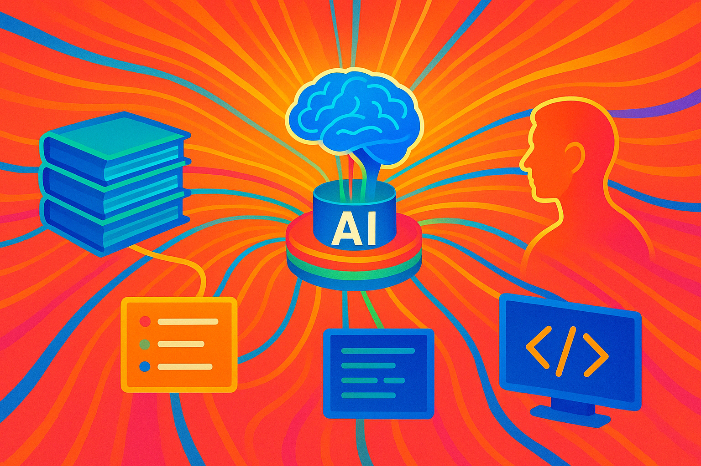
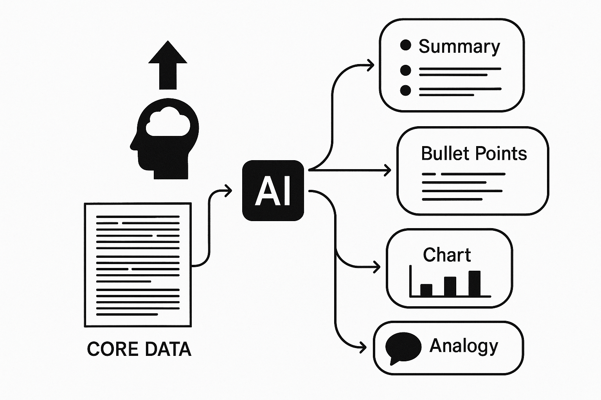

---

title: AI is a Semantic Layer for Dynamic Data Representation
date: 2025-05-31

# AI is a Semantic Layer for Dynamic Data Representation
---

<!-- more -->

*[Image generated with GPT-4o](https://chatgpt.com/)*

The current discourse around AI often frames it as either a sophisticated tool for specific tasks or an intelligent collaborator. I actually did a video on this if you want to check it out [here](https://youtube.com/shorts/K_w_iaqCPUA?si=_I57BfArjVeH4Lju).

While true, this perspective overlooks a more profound capability: AI, particularly Large Language Models, can function as a powerful semantic layer for data transformation. 

Instead of just processing data or generating new content based on prompts, it can fundamentally alter the representation of existing information, making it more accessible, relevant, and useful for human cognition in diverse contexts. 

To illustrate that I like the example of 'semantic zooming', a term I heard first in this amazing [presentation by Amelia Watenberger](https://youtu.be/PAy_GHUAICw?si=3zixmSXg6Lm0qhyq) at the AI Engineer Summit.

Imagine you have a pdf with a special slider that allows you to zoom in and out of the book at will:

1. Zooming in means reading more and more detailed version of the content (final level being the original source)
2. Zooming out means reading summaries of larger and larger strategic chunks of the content like chapters and sections

*[Image generated with GPT-4o](https://chatgpt.com/)*

Amelia shows a nice demo of this idea in this [section of her presentation](https://youtu.be/PAy_GHUAICw?t=416).

I tried to replicate this in a [simple html/js app](../assets/semantic_zoom_demo.html).

This isn't just about automation; it's about reshaping the very fabric of how data is presented to us. LLMs used like this can change how we relate to information by providing appropriate representations of knowledge in a shape that matches our context and goals.

This transformative power stems from AI's ability to understand and manipulate information at various levels of abstraction.

Imagine a dense legal document or a complex dataset. AI can digest this raw input and then, on demand, re-present it as a concise summary, a set of key bullet points, a visual trend, or even a comparison tailored to specific criteria. The core information remains, but its form is dynamically adapted to suit the user's immediate need or cognitive load, moving fluidly between granular detail and high-level overviews.

*[Image generated with GPT-4o](https://chatgpt.com/)*

## AI as Augmentation and Translation

There is an exciting possibility for AI to be an ‘engine’ under the hood of every interface—transforming data between abstraction levels so humans can focus on meaning. AI can act as a translation layer between humans and software/information/complexity, it doesn’t just show data, it transforms it into the right resolution for the task. I am interested in AI as a potential scaffold of micro-automations that augment human work. It's not about isolated outputs, its about looking at how the dynamic generation of useful and functional outputs can change the way we interact with information, not only to maximize insight anad make us more efficient but to give us new ways of looking at data.

The ultimate impact of viewing AI as a data transformation layer is a fundamental shift in our interaction with information. It moves beyond simply offloading tasks to AI and instead empowers us to navigate and comprehend complex information landscapes with unprecedented ease. By allowing us to choose the "zoom level" or "angle" from which we view data, AI augments our understanding,facilitates quicker insights, and enables more informed decision-making, effectively turning information overload into actionable intelligence.

---