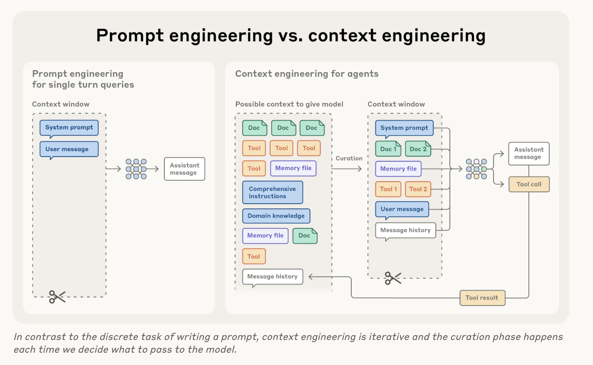

---

title: Notes on Context Engineering
date: 2025-11-02

# Notes on Context Engineering
---

<!-- more -->

## Notes on Anthropic's Context Engineering Blog post

- [Working with LLMs effectively requires thinking in context, which means considering the holistic state available to the LLM and what kinds of behaviors that state might yield](https://www.anthropic.com/engineering/effective-context-engineering-for-ai-agents#:~:text=Context%20refers%20to,steerable%2C%20effective%20agents.)

- [Context engineering simple definition: set of strategies for curating context for LLMs (during inference and after) to optimize performance](https://www.anthropic.com/engineering/effective-context-engineering-for-ai-agents#:~:text=context%20engineering%20refers%20to%20the%20set%20of%20strategies%20for%20curating%20and%20maintaining%20the%20optimal%20set%20of%20tokens%20(information)%20during%20llm%20inference%2C%20including%20all%20the%20other%20information%20that%20may%20land%20there%20outside%20of%20the%20prompts.)

- [Context state: system instructions, tools, external data, message history, etc...](https://www.anthropic.com/engineering/effective-context-engineering-for-ai-agents#:~:text=In%20the%20early,message%20history%2C%20etc)

[Image taken from Anthropic article](https://www.anthropic.com/engineering/effective-context-engineering-for-ai-agents#:~:text=of%20possible%20information.-,In%20contrast%20to%20the,to%20building%20capable%20agents,-Despite%20their%20speed)

- [Why is context engineering relevant?](https://www.anthropic.com/engineering/effective-context-engineering-for-ai-agents#:~:text=Despite%20their%20speed,that%20context%20decreases.) Due to [context rot](https://research.trychroma.com/context-rot), which is the process where as the context of a model increases, its ability to recall information from that context decreases

- [Attention scarcity in LLMs is related to its transformer architecture where tokens attend to each other within the context leading to n^2 pairwise relationships for n tokens, therefore as context increases the ability to to attend to all these relationships gets stretched thin, creating a tension between context size and attention focus.](https://www.anthropic.com/engineering/effective-context-engineering-for-ai-agents#:~:text=As%20its%20context,context-wide%20dependencies.)
- [Models are also more used to shorter sequences, meaning less experience with context wide dependencies](https://www.anthropic.com/engineering/effective-context-engineering-for-ai-agents#:~:text=As%20its%20context,context-wide%20dependencies.)  
- Great quote defining the goal of context engineering:

    > good context engineering means finding the smallest possible set of high-signal tokens that maximize the likelihood of some desired outcome.

- [System prompt should be a balance between too strict instructions and too vague, calibrating to allow for behavioral guidance while maintaining flexibility for strong heuristics to guide behavior.](https://www.anthropic.com/engineering/effective-context-engineering-for-ai-agents#:~:text=System%20prompts%20should,assume%20shared%20context.)

- [Organize prompts with sections (using XML or markdown headers)](https://www.anthropic.com/engineering/effective-context-engineering-for-ai-agents#:~:text=We%20recommend%20organizing,become%20more%20capable.)

> minimal set of information that fully outlines your expected behavior. 

- [Start with minimal and improve instructions based on failure modes](https://www.anthropic.com/engineering/effective-context-engineering-for-ai-agents#:~:text=It%E2%80%99s%20best%20to,efficient%20agent%20behaviors.)

- [Curate carefully examples for optimizing Agent behavior and avoid overhead in maintenance or context bloat](https://www.anthropic.com/engineering/effective-context-engineering-for-ai-agents#:~:text=instead%2C%20we%20recommend%20working%20to%20curate%20a%20set%20of%20diverse%2C%20canonical%20examples%20that%20effectively%20portray%20the%20expected%20behavior%20of%20the%20agent.%20for%20an%20llm%2C%20examples%20are%20the%20%E2%80%9Cpictures%E2%80%9D%20worth%20a%20thousand%20words.)

- Agents: ["LLMs autonomously using tools in a loop."](https://www.anthropic.com/engineering/effective-context-engineering-for-ai-agents#:~:text=llms%20autonomously%20using%20tools%20in%20a%20loop.)

- ["Just-in-time" context strategies means dynamically loading what the agent needs when it needs it](https://www.anthropic.com/engineering/effective-context-engineering-for-ai-agents#:~:text=rather%20than%20pre-processing%20all%20relevant%20data%20up%20front%2C%20agents%20built%20with%20the%20%E2%80%9Cjust%20in%20time%E2%80%9D%20approach%20maintain%20lightweight%20identifiers%20(file%20paths%2C%20stored%20queries%2C%20web%20links%2C%20etc.)%20and%20use%20these%20references%20to%20dynamically%20load%20data%20into%20context%20at%20runtime%20using%20tools)

- [Allow for discovery and autonomous data retrieval for a self-managed context windows to keep the agent focused on relevant subsets rather than drown in potentially irrelevant information](https://www.anthropic.com/engineering/effective-context-engineering-for-ai-agents#:~:text=Letting%20agents%20navigate,potentially%20irrelevant%20information.)

- Hybrid strategies with agents (like using `CLAUDE.md` files for Claude Code) represent this acknowledgement that as agents become more intelligent they will require less human curation over time so the advice Anthropic gives is:

    > ["do the simplest thing that works" ](https://www.anthropic.com/engineering/effective-context-engineering-for-ai-agents#:~:text=The%20hybrid%20strategy,top%20of%20Claude.)

- Techniques to address context polution constraints for long horizon tasks:
  - [**compaction**: summarizing a conversation near its context window limits and starting a fresh new context window](https://www.anthropic.com/engineering/effective-context-engineering-for-ai-agents#:~:text=multi-agent%20architectures.-,Compaction,with%20minimal%20performance%20degradation.,-In%20Claude%20Code).
        
      - [tool results clearing is a simple example of something that can be removed from the agent's trace without much impact in performance](https://www.anthropic.com/engineering/effective-context-engineering-for-ai-agents#:~:text=an%20example%20of%20low-hanging%20superfluous%20content%20is%20clearing%20tool%20calls%20and%20results%20%E2%80%93%20once%20a%20tool%20has%20been%20called%20deep%20in%20the%20message%20history%2C%20why%20would%20the%20agent%20need%20to%20see%20the%20raw%20result%20again%3F%20one%20of%20the%20safest%20lightest%20touch%20forms%20of%20compaction%20is%20tool%20result%20clearing%2C%20most%20recently%20launched%20as%20a)

  - structured note-taking: agents writes external notes for later retrieval on demand
    - For example a todo list for keeping track of progress, having a `NOTES.md` file for maintaining critical context
    - [They exemplify this with an example of Claude playing pokemon](https://www.anthropic.com/engineering/effective-context-engineering-for-ai-agents#:~:text=Claude%20playing%20Pok%C3%A9mon,against%20different%20opponents.)
    - [They built a memory tool with the Sonnet 4.5 launch](https://www.anthropic.com/engineering/effective-context-engineering-for-ai-agents#:~:text=As%20part%20of,everything%20in%20context.)

  - sub-agent architectures: 
    - [involves using specialized sub-agents with clean focused tasks and a clean context window](https://www.anthropic.com/engineering/effective-context-engineering-for-ai-agents#:~:text=Sub-agent%20architectures-,Sub-agent%20architectures%20provide,task%20characteristics.%20For%20example%3A,-Compaction%20maintains%20conversational)
    - ideal for complex research tasks
  - When to use each strategy:
    - Compaction for extensive back-and-forth conversational tasks
    - note-taking for iterative development with clear milestones
    - multi-agent architectures for complex research and analysis where parallel exploration pays dividends

## Agentic Loops

- New skill to develop: [designing agentic loops](https://simonwillison.net/2025/Sep/30/designing-agentic-loops/#:~:text=A%20critical%20new,an%20effective%20solution.)

- Yolo mode (running coding agents with automatic approval)
  - [Risks:](https://simonwillison.net/2025/Sep/30/designing-agentic-loops/#:~:text=Bad%20shell%20commands,other%20hacking%20attacks.)
    - bad shell commands deleting or maing stuff
    - exfiltration attacks
    - attacks that use your machine as a proxy to attack another target
  - [options](https://simonwillison.net/2025/Sep/30/designing-agentic-loops/#:~:text=Run%20your%20agent,cause%20any%20damage.)
    - Run your agent in a secure sandbox
      - acceptable options for most
        - https://github.com/apple/container
        - Docker
        - But remember this is not perfect! [(container escapes)](https://attack.mitre.org/techniques/T1611/)
    - Use someone else's computer
    - Just risk it! (avoid expositing it to potentially palicious sources)
    - [Best option for Simon: Github Codespaces](https://simonwillison.net/2025/Sep/30/designing-agentic-loops/#:~:text=Option%202%20is,attached%20GitHub%20repository.)
  - Set credentials with tight budget limit on staging environments to contain any potential damage then design a cool [agentic loop like this for testing, exploring, prototyping...](https://simonwillison.net/2025/Sep/30/designing-agentic-loops/#:~:text=without%20extra%20guidance.-,Issuing%20tightly%20scoped%20credentials,important%20skill%20to%20develop.,-When%20to%20design)
    - [Criteria for when to design an agentic loop is the existence of a bunch of potential trial and errors in the task](https://simonwillison.net/2025/Sep/30/designing-agentic-loops/#:~:text=not%20every%20problem%20responds%20well%20to%20this%20pattern%20of%20working.%20the%20thing%20to%20look%20out%20for%20here%20are%20problems%20with%20clear%20success%20criteria%20where%20finding%20a%20good%20solution%20is%20likely%20to%20involve%20(potentially%20slightly%20tedious)%20trial%20and%20error.)
  - [Examples of scenarios for agentic loops](https://simonwillison.net/2025/Sep/30/designing-agentic-loops/#:~:text=A%20few%20examples,the%20tests%20passing.): debugging, performance optimization, upgrading dependencies, optimizing container sizes.
  - Automated tests!

    > [The value you can get from coding agents and other LLM coding tools is massively amplified by a good, cleanly passing test suite.](https://simonwillison.net/2025/Sep/30/designing-agentic-loops/#:~:text=the%20value%20you%20can%20get%20from%20coding%20agents%20and%20other%20llm%20coding%20tools%20is%20massively%20amplified%20by%20a%20good%2C%20cleanly%20passing%20test%20suite.%20) 

[Subscribe to my Newsletter](https://automata-learning-lab.kit.com/ccd5287996){ .md-button .md-button--primary }
[Subscribe to my YouTube](https://www.youtube.com/@automatalearninglab){ .md-button .md-button--secondary }
