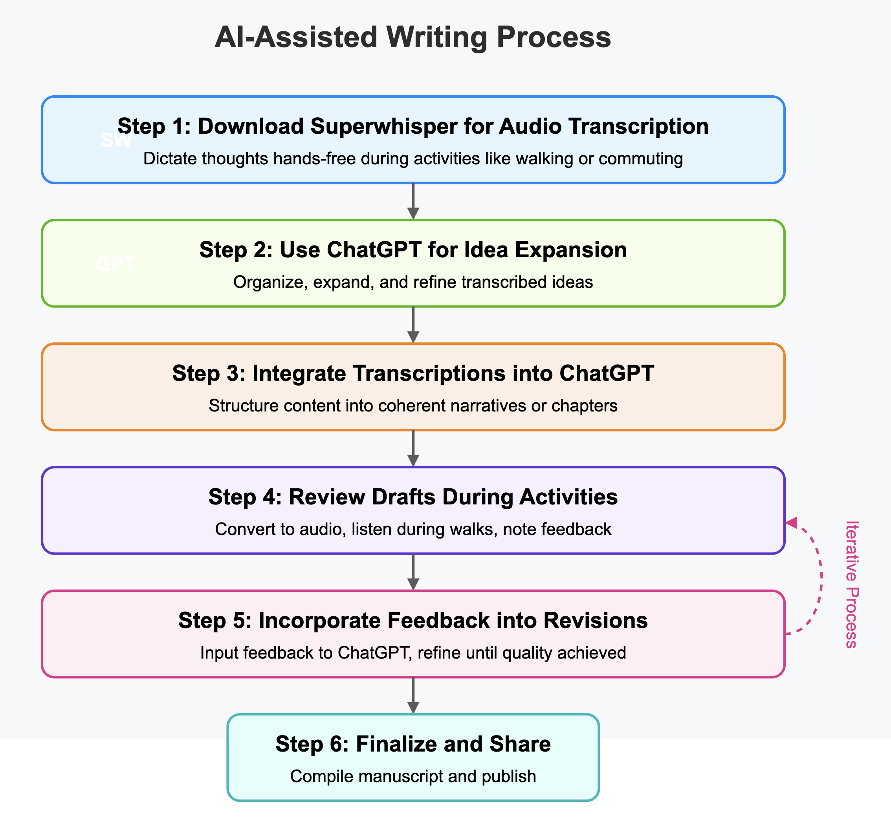

# **An Audio-based AI-co-writing workflow**




## Step 1 - Download [Superwhisper](https://superwhisper.com/) for Audio Transcription:
 
 - [For IOS Users](https://apps.apple.com/us/app/superwhisper/id6471464415)

Superwhisper allows users to dictate thoughts and ideas, transforming them into structured text. This hands-free approach enables brainstorming sessions during activities like walking or commuting.  

## Step 2 - Use [ChatGPT](https://chatgpt.com/) for Idea Expansion and Structuring:

- [Download the ChatGPT app on the APP Store](https://apps.apple.com/us/app/chatgpt/id6448311069)

ChatGPT assists in organizing, expanding, and refining transcribed ideas. With a ChatGPT Plus subscription, users gain access to advanced features, enhancing the creative writing process.

## Step 3 - Integrate Transcriptions into ChatGPT for Refinement
 - Import the transcribed content from Superwhisper into ChatGPT.
 - Use ChatGPT to brainstorm, reframe, and expand upon the initial ideas, structuring them into coherent narratives or chapters.

## Step 4 - Review Drafts During Activities 
 - Convert drafts into audio formats to listen during walks or other activities.
 - You can do that with apps like [speechify](https://speechify.com/?srsltid=AfmBOooBYXnX9ZSy1WxsPFsM6jLbqWHUV_MsilKbB1yMwZpcwt30ysNo)
 - Note down feedback, ideas, or areas of improvement during these sessions (you can do it all with audio using super whisper or recording on your phone using the Iphone default voice memo app or something similar)

## Step 5 - Incorporate Feedback into Revisions 
 - Input the gathered feedback into ChatGPT to refine and enhance the drafts.
 - Repeat this iterative process until the desired quality is achieved.
 - At this stage compile insights as bites into something like a notes app or doc.

## Step 6 - Finalize and Share 
 - Once satisfied, compile the chapters or sections into a complete manuscript.
 - Share the final version with peers, editors, or publish as desired.

## **Example Walkthrough**

1. Open SuperWhisper on your phone (step 3)
2. Dictate your thoughts about what you want to write about or expand (make these dictations small less than a minute) (step 3)
3. Copy paste that into ChatGPT with a Prompt that gives it the context of what you want to do for example you can prompt ChatGPT with this: (step 3)
```
I’m going to brainstorm plot ideas for a space opera novel. Please take everything I say, focusing on key characters, main conflict, and potential locations. At the end, organize the notes into a simple bullet list with headings for Characters, Conflict, and Setting.

{{PASTE YOUR AUDIO TRANSCRIBED FROM SUPERWHISPER HERE}}
```
4. Take that output and reflect on it (perhaps during another walk?) and if you want to expand on it you can use the feature "Advanced Voice Mode" from ChatGPT directly on your phone to 'talk' to ChatGPT about those ideas. (step 3-4-5)

5. Do this in a loop:
   1. Record your thoughts with superwhisper
   2. Copy paste that into ChatGPT with some input for how you want to process those 'raw thoughts'
      1. It can be like 'Structure this into bullet points'
      2. But also something like: 'Can you rephrase these ideas?'
      3. You can do whatever! Be creative
   3. Take whatever output you get back as your starting point for the next part (always working in small gradual reflexive steps)
   4. Copy paste the main insights into something like a google doc or your notes app to keep track of insights as bites of thoughts that will be later compiled into something like a full blog post, chapter, etc...
   5.  Iterate until you have a draft (that usually is a bunch of rich insightful notes inside ChatGPT or that you copy pasted from there into some notes app or doc)
