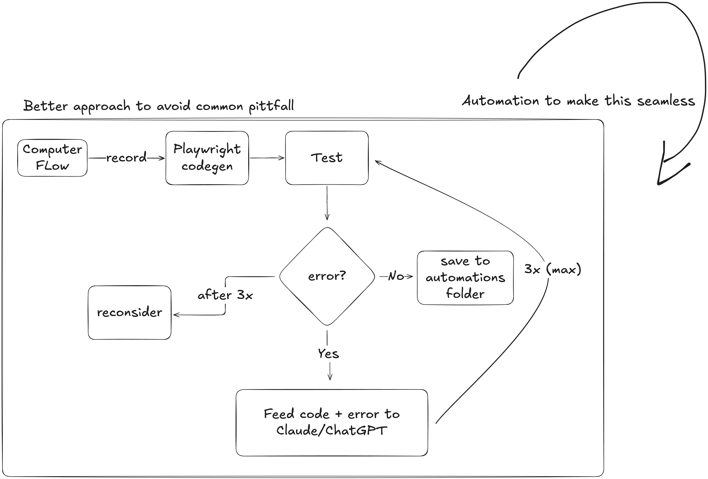

# My Naive Browser Automation Workflow

I am working on my course coming up this february 3rd about [automating tasks with AI tools and Python](https://learning.oreilly.com/live-events/using-ai-tools-and-python-to-automate-tasks/0642572011642/), and I came across an interesting 'fake discovery' when it comes to automation browser tasks. 

Let me first show the diagram I made, and then we can chat about what it means:

 