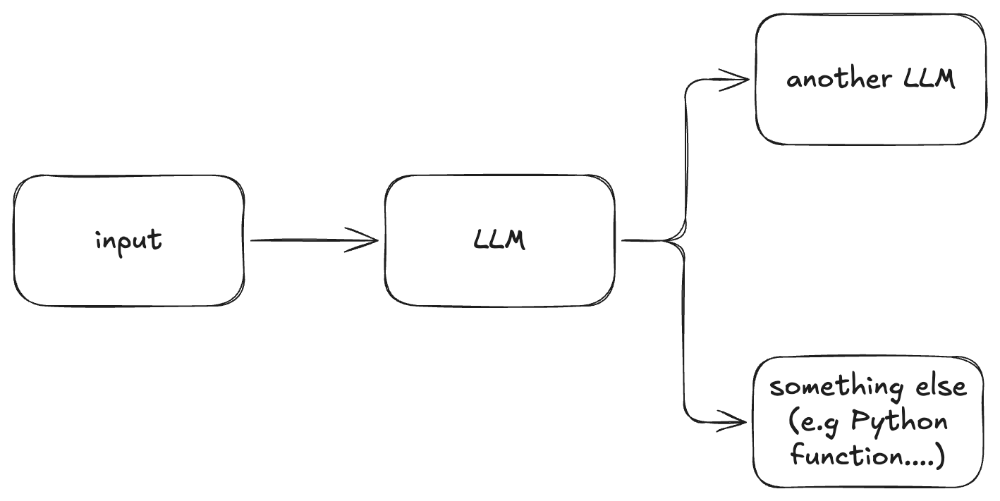
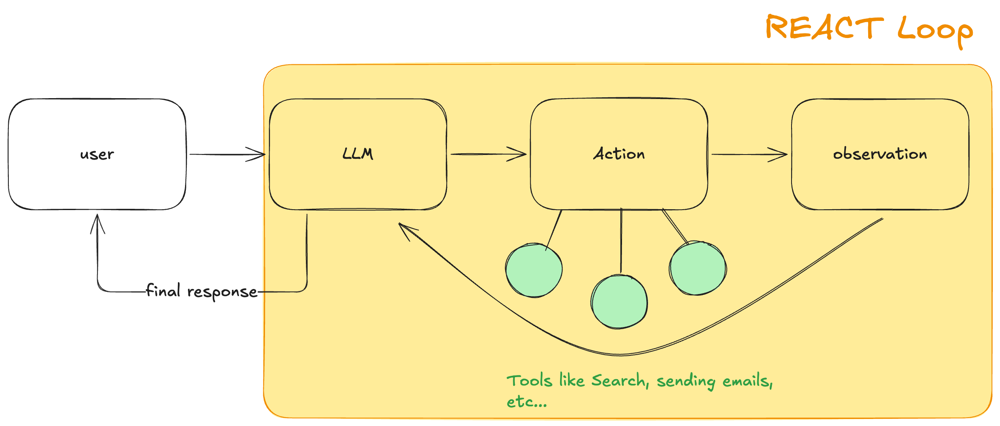
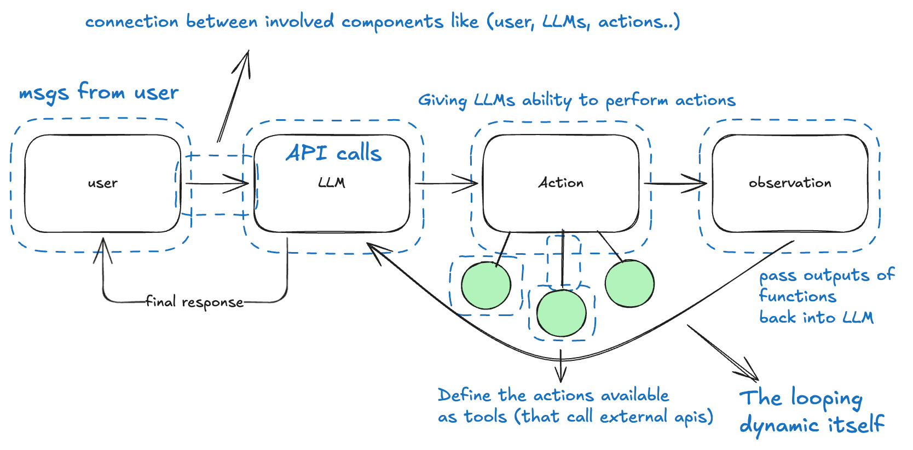
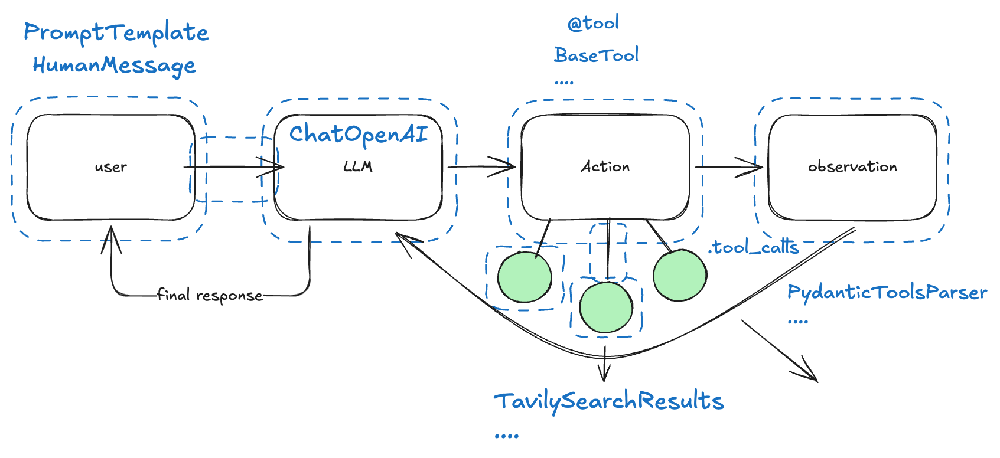
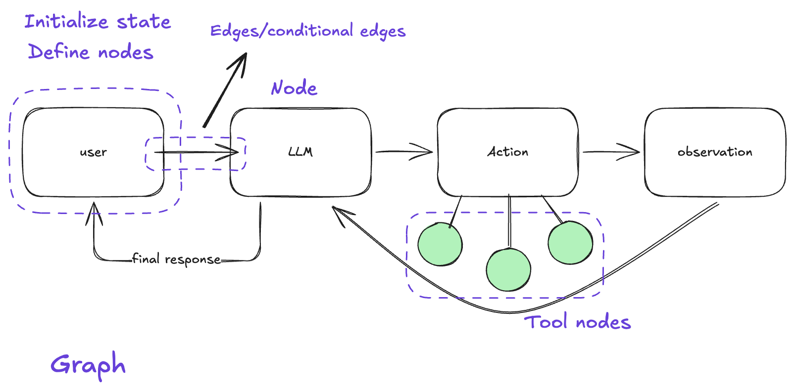
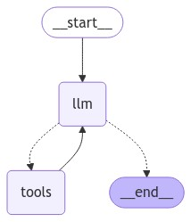

article---
title: An Intuitive Introduction to LangGraph
date: 2025-02-10
---

# An Intuitive Introduction to LangGraph

## Routing Stuff

I'm working on my [LangGraph](https://www.langchain.com/langgraph) course and I kind of wanted to do a little recap of how I see this framework in the big scheme of things.

When working with LLMs, one common pattern that exists is to [route stuff](https://arc.net/l/quote/yrhkgldc), meaning you send some input to an LLM and the output of that gets routed to either another LLM as described in this [article by Anthropic about common patterns for working with LLMs](https://arc.net/l/quote/yrhkgldc) or even to some other functionality like you might use some Python function to clean the output of that LLM.  



This is great because the LLM has some type of understanding of what is going on even though we still don't really understand the nature of this understanding, however it is good enough that we can actually use it to make some processing pipeline a bit leaner by having LLMs make certain decisions within some narrow scopes of a workflow.

## The Abstraction Challenge

Now, if I am writing up a system that can perform complex tasks, 

??? note "What do I mean by complex?"
    Integration of a diverse set of components that do all sorts of different things like performing actions, calling apis, processing massive amounts of diverse data like text and images, and so on.

it is a bit problematic to implement it just as simple calls to apis like OpenAI or Anthropic's, because we want that system to be pragmatically improvable (robust, consistent). 

What I mean is that despite wanting the flexibility brought by LLMs, we also want the controllability offered by writing software that does stuff deterministically and can be systematically improved over time.

So that begs the question of how we create useful abstractions around the capabilities of [Large Language Models](https://www.youtube.com/watch?v=zjkBMFhNj_g)? 

To understand that, we need to understand what we are trying to abstract, for that, let's take the most common pattern in this emerging field of Agents that is growing quite a bit this year: [React](https://arxiv.org/pdf/2210.03629) [Agent](https://www.promptingguide.ai/research/llm-agents).



What is there to abstract?

Well, a bunch of stuff, if want to be able to develop a system aroud these things we need to be able to abtract things like:

1. Messaging between user and LLM apis
2. Calling LLM apis
3. Integrating tools into LLMs as functions that call external APIs

and much more (see diagram below).



Not only that, but we also want to be able to track and monitor these parts so that when problems occured we can investigate what happen and debug our system across all of its parts.

## LangChain

[LangChain](https://www.langchain.com/) came into the scene as a framework that allowed you to put all these different parts that are common when building LLM apps, into the same 'system'. 

In LangChain everything is a [runnable](https://python.langchain.com/api_reference/core/runnables/langchain_core.runnables.base.Runnable.html), which means, things like calling an LLM, calling a tool that performs some action, the prompt that you send to the model, and many other things like that become all components in this runnable interface that can be organized via the usage of a declarative language called [LCEL (LangChain Expression Language)](https://python.langchain.com/docs/concepts/lcel/).

The idea is that you can create `chains` which in LangChain are building blocks made out of the component parts like [`prompt template`](https://python.langchain.com/docs/concepts/prompt_templates/) [`chat models`](https://python.langchain.com/docs/concepts/chat_models/) and [many others](https://python.langchain.com/docs/integrations/components/), in order to create modular workflows that have swappable parts.



LangChain became extremely popular I think in part because they were the first to realize that there was much more value to be extracted from LLMs than just asking them for text and getting results back, building on top of super important papers that started to explore these additional functionalities like:

- [Toolformer: Language Models Can Teach Themselves to Use Tools](https://arxiv.org/abs/2302.04761)
- [Retrieval-Augmented Generation for Knowledge-Intensive NLP Tasks](https://arxiv.org/abs/2005.11401)
- [ReAct: Synergizing Reasoning and Acting in Language Models](https://arxiv.org/abs/2210.03629)

However, building this framework came at the cost of having to make choices for how the infrastructure around LLMs should look like, which is not a trivial problem because we are talking about a technology in its infancy, consider that ChatGPT was released in 2022!

## LangGraph

Regardless of what the ultimate abstraction for LLMs look like, what we know right now is that there are common patterns for using it, which usually involve taking some input and passing it through a set of transformations, some of which are handled by LLMs (so not completely deterministic) and some are handled by normal code.

What the LangChain folks realized is that most of what we do with LLMs could actually be handled by treating the entire process as [graphs](https://arc.net/l/quote/xvtysjuz) with nodes and edges to integrate controllability into the system while mixing it with the flexible nature of LLMs.

So LangGraph was born.

The way I look at it, LangChain gives you the material to do the basics
with LLMs like:

- Call LLM APIs
- Integrate Prompts
- Loading documents
- Tools, retrievers for rag systems
- ....

however, when it comes to putting together a system, connecting different things and managing all of that, the LCEL comes short of something simple and intuitive that can give you manageable complexity and controlability.

So LangGraph shows up as a framework that can take in the standardization provided by operating on LangChain Components, and provide the graph building capabilities that are considerably more intuitive when compared to 'chaining runnables'.



In LangGraph you introduce [cycles](https://blog.langchain.dev/langgraph/) into these chains, in the form of 'controlled flows' or 'state machines':

> *[LangGraph is a way to create these state machines by specifying them as graphs.](https://blog.langchain.dev/langgraph/#:~:text=LangGraph%20is%20a%20way%20to%20create%20these%20state%20machines%20by%20specifying%20them%20as%20graphs.)*

## What Do we Get with Graphs?

### States, Nodes & Edges

In LangGraph the logic is to define some initial 'state' which is a data structure that will be updated throughout the execution of the graph.

Let's take this diagram we showed of the simple react agent loop, where we have some input coming in to a model connected to some tools, and the model is going to go on a loop of calling said tools until a response is generated.

For something like that we would need to define:

1. The LLM to use
2. The tools that model has access to
3. Connect LLM to the tools (so the model can [create the arguments for it](https://platform.openai.com/docs/guides/function-calling))

```python
from langchain_community.tools import TavilySearchResults 
from langchain_anthropic import ChatAnthropic

# The LLM
llm = ChatAnthropic(model="claude-3-5-sonnet-latest")
# The tool (for web search)
search_tool = TavilySearchResults()
# Connect LLM to tool 
llm_with_tools = llm.bind_tools([search_tool])
```

Now, we need to take this core set of functionality we've built and
inserted in a graph. To do so we need:

1. To define a **state**
2. **Nodes** (that perform the computations)
3. **Edges** (that connect everything together)

The **state** will define this updatable data structure that will change
throughout the execution of the graph. The **nodes** will be the functions
that perform the computations that happen throughout this graph like
running LLM calls, using the tools and so on.

The **edges** will join all the nodes together defining the direction
of this graph.

We start by defining the nodes as simple python functions:

```python
# The node where the LLM+tools is called
def llm_node(state: MessagesState):
    # Gets the latest message in the messages list
    response = llm_with_tools.invoke(state["messages"])
    print("response")
    print(response)
    # returns a dictionary that corresponds to updating the state
    # adding a the message from the model's response
    return {"messages": [response]}

# The node that performs the conditional logic that defines whether the
# LLM will call a tool and return a final output to the user 
def router_node(state: MessagesState):
    if state["messages"][-1].tool_calls:
        # routes to a node called: "tools"
        return "tools"
    
    # if there is no action required, we end the loop
    return END
```

NOw that we have the nodes as python functions, we can define our graph. 
We start by defining the initial state as a `MessagesState` object,
which means its a data structure that contains a default list of messages
inside + the ability to add more messages to this list as the graph
get's executed.

```python
builder = StateGraph(MessagesState)
```

We integrate the nodes we've created earlier:
```python
builder.add_node("llm", llm_node)
builder.add_node("tools", tool_node)
```

We set an entry point for the graph
```python
# we set the entry point for the graph to be the llm
# which means the user will send the input directly to the LLM
builder.add_edge(START, "llm")
```
Connect the llm to the function containing the conditional logic that routes information either to the user (END) or to the node containing the tools, and compile the graph.

```python
builder.add_conditional_edges("llm", router_node, ["tools", END])
# Here we make it so that the output of the tools node has to go to the "llm"
builder.add_edge("tools", "llm")

graph = builder.compile()
```

Great! Now we can see how it looks!

```python
try:
    display(Image(graph.get_graph().draw_mermaid_png()))
except Exception:
    # This requires some extra dependencies and is optional
    print("Did not display graph")
    pass
```



Looks pretty simple right? But now, we can actually have it look up information online and return written results!

```python
graph.invoke(
    {
        "messages": ["human", "Search online for current AI conferences happening in Silicon Valley right now."]
    }
)
```

There are many other core concepts in LangGraph such as:

- Persistence & Memory
- Subgraphs
- Configuration
- Command
- ....

We'll leave that for another article! :)

Cheers!

---

[Subscribe to my Newsletter](https://automata-learning-lab.kit.com/ccd5287996){ .md-button .md-button--primary }


