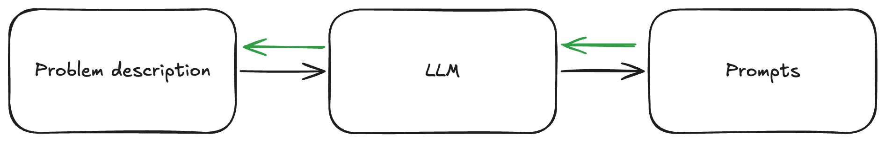

 

# Patterns for Effective Usage of LLMs

## Code Generation

**Paste code + error ask it to debug**

Copy paste from ChatGPT/Claude/Gemini/Llama3 and also paste in error + original code
to get better answer.

**Automate Cleaning AI Output**

Setup a quick tool to clean up the Python code generated (I use an alias `clean-python`)

**Use Standalone Scripts with AI + uv**

Generate Python standalone scripts by using Claude+Projects with custom descriptions and the uv package manager

**Leverage Context**

For recent coding frameworks use the documentation as json/markdown files as context for something like Claude/ChatGPT projects.
Show LLM how to call an API (in the prompt) then ask it to create something with that api.


# General Usage

**Let it see your screen**

Use tools like Gemini 2.0 with streaming in realtime in Google AI Studio
so the AI can see your screen to help you navigate new software and answer app specific
questions in context.

**Save your AI Mistakes**

When AI makes a mistake save it for later as your own personal benchmark

**Build Micro-AI-Powered Data Transformation Pipelines**

Build app with AI that takes in data with a certain structure and outputs 
desirable output, format, etc.... then make a prompt template that 
produces the data into the format acceptable 
by that app (done).  

**Conceptual Knowledge Prompting**

When creating knowledge management prompts (like for Anki cards), structure them around these 5 key dimensions:
- Attributes & tendencies
- Similarities and differences
- Parts & Wholes
- Causes & Effects
- Significance & Implications

This helps move beyond simple memorization towards deeper encoding of knowledge.

**Background AI Assistance**

Run lighter models (Tier 3) in the background to provide gentle guidance without disrupting workflow. For example:
- Watching note creation to suggest knowledge structuring patterns
- Using SuperWhisper to transform free-form thinking into structured content
- Converting audio brainstorming into written documentation

## Patterns for Prompt Templates

**Informed transformation** 

```
Given this {{ context }}. Do {{ action }} to this {{ content }}.
```

**The OUTPUT ONLY Pattern**

Prime model at the very end to: 

```(...previous context...) OUTPUT ONLY {{ desired output }}```

**Use Meta Prompts**

Use prompts for prompts! Create a prompt that uses a model to 
generate multiple prompts that address all the parts of your task.



For example:

```
I need to create a series of prompts to help me analyze customer feedback data. 
Please generate 3 prompts for an LLM model to help me:

1. Extract key themes and sentiment
2. Identify urgent issues needing attention
3. Generate actionable insights for product improvements

For each prompt you generate, explain its purpose and expected output format.

OUTPUT ONLY the prompts and their explanations, formatted as such:
PURPOSE: <purpose of prompt>
Instruction: <main instruction>
OUTPUT FORMAT: <desired output format>
```

You can also ask the model to break down the problem itself given some 
initial goal or intention and then for each sub-task ask for a solution:

## Which Models to Use When

### Model Tiers

#### Tier 1 (High Intelligence, Slow, Expensive)

- For complex, nuanced tasks
- Examples: DeepSeek, O1.  

#### Tier 2 (Balanced)

- It is your daily driver for most tasks – code, emails, general queries
- Examples: GPT-4o, Claude 3.5 Sonnet, Gemini 1.5 Pro, Llama 3.3.

#### Tier 3 (Cheap, Fast) 
- For bulk, everyday tasks
- Examples: GPT-4o-mini, Gemini Flash, Llama 3.1/3.2.
- Enables AI usage in "every nook and cranny"

### Workflow Example
1. Use **Tier 3** to process large documents quickly and cheaply
2. Use **Tier 2** to refine and apply structured outputs
3. Use **Tier 1** for final critical reasoning or complex synthesis